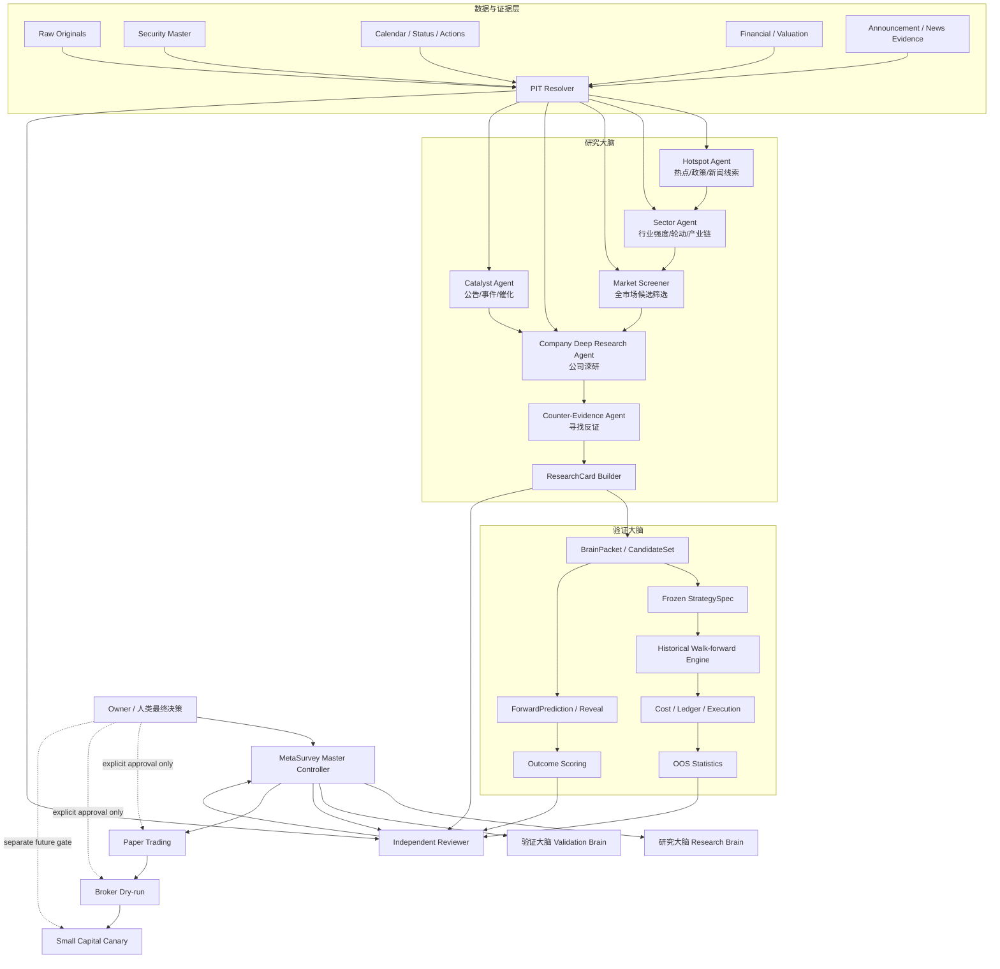
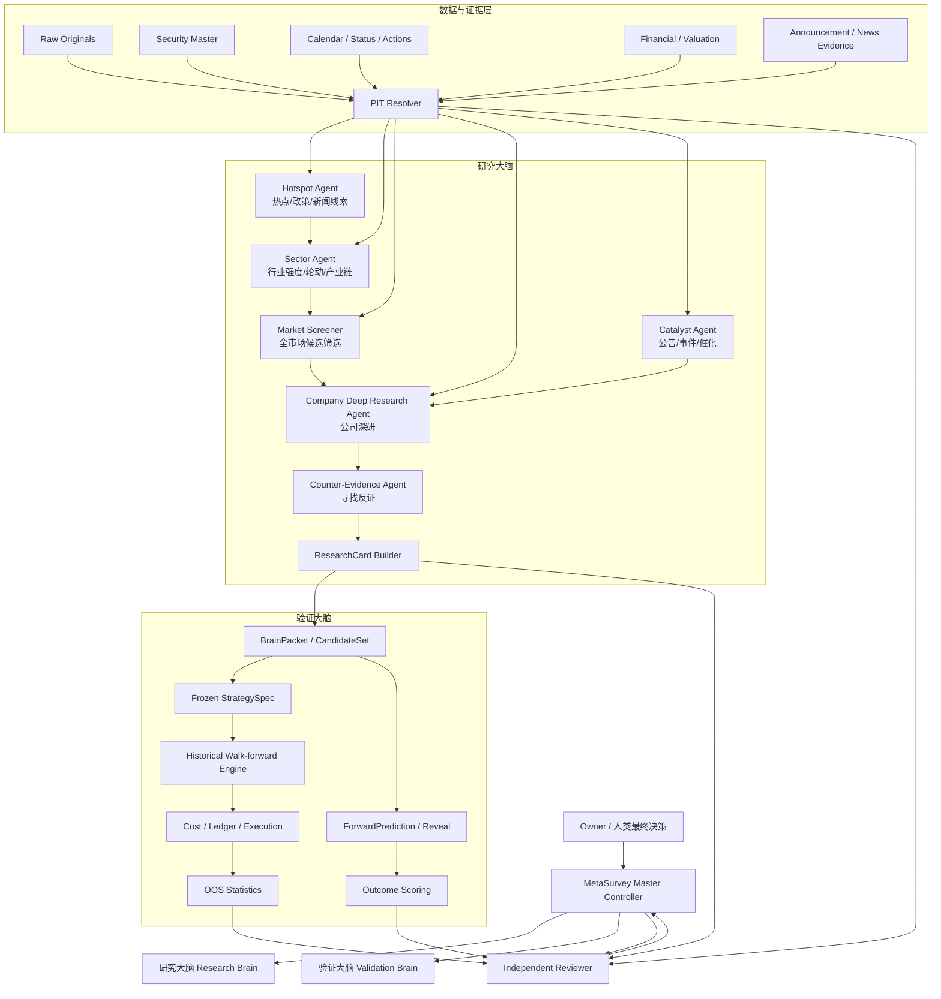

# 当前状态与接手执行卡

只读核对截止：**2026-10-08T22:10:01+08:00（Asia/Shanghai）**。本卡补充当前操作信息，下面背景报告原文字节保留；下载原件未改。正式 [V1 交接文档](../specifications/V1-Engineering-Handoff.md)及 Owner 明确授权优先。本卡不新增 Gate、不批准正文中的建议任务。原文引用标记未补造，核验依据见 [证据索引](Evidence-Index-20261008.json)。

**版本快照（本次文档提交前）**：以下三个工作区均清洁；后续接手重新确认 HEAD。公开版与源工程版本对应关系见 [Source-Snapshot](../review/Source-Snapshot.json)。

| 工作区（均位于 `/Users/qiushi/投资研究/`） | 分支 | HEAD |
|---|---|---|
| `ashare-trading-v1` 主控 | `publication/github-20261008` | `a4120e0bff1d` |
| `ashare-backtest-5y` 专项，只读核对 | `backtest/5y-initial-review-20261008` | `4252876e2322` |
| `metasurvey-github` 公开镜像 | `main` | `0115865b30e98` |

**当前结论**：P1 主控工程集成 `PASS_WITH_CONDITIONS`；六 DTO `1.0.1-candidate` 最终冻结 HOLD，M01–M08 待 Owner 批准。最新封存报告记录 7,567 个股票价格日期、582 条财报期记录，已超出正文早期“每股 327 日”的范围；仍为实际 PIT 准入 0、`ENGINE_NOT_RUN`、收益/回撤等 `NULL`、`untouched_oos=false`。Forward 四文件与既有封存清单匹配，D1 文件仍为空；最新集成记录 Snapshot B 未运行、实际前向日数 0。本轮没有重新核验实际签名授权链或采集市场数据。

**最近检查 / 进行中**：公开版本 `0115865` 的[双平台 CI](https://github.com/Qiushi0919/MetaSurvey/actions/runs/37787826613)成功；本轮仅做只读复跑和交接整理，未重跑全套 Gate。各工程交付记录均要求交付后停止，其他对话的即时运行状态待核实。

**最小运行**：新机器先按[公开检查说明](../review/TESTING.md)准备 Node 24 / Python 3.12、执行 `npm ci --ignore-scripts` 并运行合成检查。真实研究复跑另外依赖本机私有档案；公开仓库不含这些原件。本机已实测 Python 3.12.14 / pypdf 6.10.0，下面只核对保留版本的已有研究，不写入专项工作区：

```sh
(
  set -e
  cd '/Users/qiushi/投资研究/ashare-backtest-5y'
  test "$(/opt/homebrew/bin/git rev-parse HEAD)" = '4252876e23224df5d29c20492a08da9436dccf4a'
  /Users/qiushi/.cache/codex-runtimes/codex-primary-runtime/dependencies/python/bin/python3 -B -m wave_d.verify
)
```

成功终端输出：`objects=10, human_reports=4, deterministic=true, productionGate=false`；核对已有的 `.p1b-archives/wave-d-20261006/results/REPORTS-G4/`，不产生新业务结果。失败先看终端 traceback/reason code，再核对 `docs/wave-d/evidence.json` 和证据索引；此入口无独立错误日志。**主控当前版本复跑会报 `WAVE_C_DEPENDENCY_INVALIDATED`**：两份 CI 文件与旧封存依赖哈希不同；不得更新旧 pin 或改 seal 使其通过。不要用 `python -m wave_d.run` 替代，它会尝试写入固定输出位置。

**关键证据**（完整预期 SHA-256、实际比对与固定版本链接均在[证据索引](Evidence-Index-20261008.json)，不是仅给计算 hash 的命令）：

| 要核对的结论 | 原始依据 / 对应版本 |
|---|---|
| 集成结果、数据数量、接口条件 | [报告](../backtest-5y-integration/Acceptance-Report.md) / [Status](../backtest-5y-integration/Status.json)，集成代码 `37ec2ec9f8f1` |
| 冻结策略及未批准方法 | [Frozen StrategySpec](../wave-f/Frozen-StrategySpec-v1.json)（`d4eb866d…215da`）/ [Owner 决策表](../core40-method-proposal/Owner-Decisions.md) |
| 研究复跑 15 件封存文件 | [原清单](../wave-d/evidence.json)，本机 `REPORTS-G4`；本轮逐项 MATCH |
| Day0 及空 D1 未被覆盖 | [既有四文件清单](../review/releases/2026-10-08-p1-integration/Forward-Readback.json)，本轮逐项 MATCH |
| 历史实际库未改 | 本机 `.p1b-archives/backtest-5y-p1-20261008/evidence.sqlite`；与集成报告固定 hash 比对 MATCH，只读字节未打开数据库 |

**接手任务卡**（描述接手顺序；未批准事项仍需原流程决定）：

| 责任线 | 上一步 → 下一步 | 可改范围 / 交付后停止 |
|---|---|---|
| 主控 | P1 集成及公开发布 → 审六 DTO 字段缺口、方法与共享边界 | 主控文档及明确获批共享变更；提交接口审核结论后停，不覆盖专项 |
| 研究 | 三股本地研究可在保留版本复跑 → 核对真实调用方向、提出研究编排方案 | 新审计文档；提交调用链及建议后停，不据正文直接扩证券池或启动多 Agent |
| 五年专项 | 原 P1 交付保留、主控副本修复已集成 → 接收主控接口反馈及下一阶段授权 | 仅自身 worktree 和授权文件；交付数据/PIT缺口与方案后停，当前不启动正式 OOS |
| Forward | Day0 冻结、D1 仍空 → 核对当日原件及 Capture / Review / Forward 人类签名链 | 主控 Forward 新增证据路径；齐备后按既有授权追加，否则交缺口后停；旧预测不可改 |

**两条解释边界**：`BrainPacket`、`ResearchCard`、`CandidateSet` 的职责和方向以现有 Schema 与调用链审计为准，正文流程图不构成接口变更授权。今天的候选集可用于当前研究、Forward 及标明范围的历史个案诊断；验证历史选股流程必须按各时点当时可见信息重建候选集，已暴露样本不得改称 untouched OOS。

真实账户/费用/风险及未批准方法继续 `UNSET_REQUIRED` 或 PENDING；正式历史/OOS、生产数据、券商、真实资金、云端研究导出继续 BLOCKED。下载与 API 可访问不证明许可或历史 PIT。交接信息补齐后停止，不自动执行下面背景报告中的任务建议。

---

以下为用户提供的背景报告原文；其中“当前”是原报告记录的状态，差异以上方带时间戳核对为准。

<!-- ORIGINAL_REPORT_BYTES_START -->
# MetaSurvey 当前状态与新对话工程交接报告

## 执行摘要

**MetaSurvey 现在已经不是一个简单的“股票指标打分器”，但也还没有发展成你设想中的完整“AI 自动投研团队”。** 从项目仓库、Wave C/D/F/G、双线验证包、Day0/Day1 验收包，以及最新五年历史回测专项首轮审查看，系统已经形成了两套明显不同的能力：一套是负责“理解公司、形成研究判断”的**研究大脑**；另一套是负责“证明这些判断不是偷看未来、扣除费用后是否真的有效”的**验证大脑**。目前后者的工程成熟度明显更高：PIT、防未来数据泄漏、费用/账本、Forward 冻结、Independent Reviewer、回测协议已经搭得比较完整；但正式五年 Historical PIT Walk-forward/OOS 仍然被数据、历史可见性和策略经济参数阻断，真实完整历史交易仍为 0。研究大脑已经能对洛阳钼业、平高电气、景旺电子生成九维度本地研究报告，并存在 `BrainPacket`、`ResearchCard`、`ResearchAssessment` 等正式接口设计，但**尚未发现一个已经生产化运行的“热点发现 Agent → 板块 Agent → Deep Research Agent → 全市场 Screener → Reviewer”的主动多 Agent 选股系统**。换句话说：**研究框架已经有了，自动发现机会的“雷达”还没有完整造好；验证实验室已经相当复杂，但还没有拿到正式五年成绩单。** 最新五年专项明确确认正式 Historical PIT/OOS 仍 BLOCKED、完整真实交易 0、收益和风险指标均为 NULL。fileciteturn0file0

### 现在最应该立即执行的行动

| 优先级 | 立即动作 | 为什么现在做 |
|---|---|---|
| **P0** | 让原主控完成“研究大脑 / 验证大脑架构冻结”，明确接口和文件所有权 | 防止五年回测和主动研究两个对话分别发明不同 CORE_40 |
| **P0** | 五年专项继续 Track A 诊断，同时 Track B 补 PIT | 不应等 PIT 全补完才测试引擎，也不能把诊断冒充正式回测 |
| **P0** | 对 `required_research_policy_decisions` 做正式 Owner 审批 | WACC/资本成本、周期盈利、概率/缓冲、基准、成本、仓位等现在仍 `UNSET_REQUIRED` |
| **P1** | 启动 Research Brain 多 Agent 审计，并建设“热点/板块/公司研究/候选池”v0 | 当前已有三股研究能力，但没有证据证明全市场主动发现系统已完成 |
| **P1** | Forward 继续保持独立冻结链，禁止历史回测代码修改已经冻结的预测 | Historical 与 Forward 应成为两套相互制约的考试 |

核心判断可以浓缩为一句：

> **MetaSurvey 现在已经具备“严谨地做研究和验证的骨架”，但还没有完成“自动找到股票 → 深度研究 → 正式回测证明有效 → 真实 Forward 复现”的完整闭环。**

## 当前系统：研究大脑与验证大脑

### 研究大脑究竟负责什么

研究大脑回答的是：

> **“市场里有什么值得研究？这家公司为什么可能值得买？最强的反对证据是什么？”**

从仓库看，它已经不是纯概念设计。

P0 已经定义 `ResearchCard`，其中明确要求保存 `thesis`、`strongest_counterevidence`、`unknowns`、`evidence_refs` 和研究周期；同时存在 `BrainPacket`，用于把经过约束的数据证据送入研究层。`ResearchAssessment` 又把研究拆成 `company_quality / sector_quality / catalyst / evidence_quality / valuation / timing / risk / cost / account_suitability / tradeability` 十个维度。（证据：`contracts/v1/ResearchCard.schema.json`、`contracts/v1/BrainPacket.schema.json`、`contracts/p1b/ResearchAssessment.schema.json`。）

Wave C 已经真正使用真实本地数据对三只股票生成研究报告：每股 31 项特征，并明确拆分 Quality 与 Timing；Wave D 又升级到每股 58 项 feature、九个研究轴：

> Business Quality  
> Earnings/Cash Quality  
> Valuation  
> Sector  
> Catalyst  
> Timing  
> Risk  
> Evidence Quality  
> Unknowns

它还生成了三股横向 `ResearchComparison`。（证据：`docs/wave-c/P1B-Wave-C-Gate-Review.md`；`docs/wave-d/P1B-Wave-D-Gate-Review.md`；`wave_d/research.py`；`wave_d/report.py`。）

但这里必须非常准确地说：

**这还不是你脑海里那个“每天自己搜索新闻、发现热点、找到板块龙头、再派几个 Deep Research Agent 深挖”的研究大脑。**

Wave C 明确记录：

> 真实 `ResearchCard = 0`

而且当时没有 ChatGPT / Deep Research 真正读取这些真实数据；model/broker 调用均为 0。正式 `RealResearchInput → ResearchAssessment → ResearchCard` 还是阻断骨架。（证据：`docs/wave-c/P1B-Wave-C-Gate-Review.md`。）

Wave D 里的 `Sector` 目前主要是来源声明的当前行业分类；历史行业成员和行业景气仍 UNKNOWN。`Catalyst` 主要检查 SSE 公告索引和正文证据，不能凭标题推导“利好”；不少公告 PDF 正文当时也未通过验证。（证据：`wave_d/research.py`、`wave_d/report.py`、`docs/wave-d/P1B-Wave-D-Gate-Review.md`。）

因此，现在研究大脑更准确的定义是：

> **“三股、当前观察、证据约束的本地研究分析器”**

而不是：

> **“全 A 股自动主动选股 Deep Research 团队”。**

### 验证大脑究竟负责什么

验证大脑回答的是：

> **“你刚才说这只股票好，有证据吗？当时真的能知道这些信息吗？按照真实交易规则买进去，扣掉费用还赚钱吗？”**

它目前包括：

```text
历史数据/PIT
    ↓
冻结 StrategySpec
    ↓
历史候选生成
    ↓
交易执行模拟
    ↓
成本/滑点/税费
    ↓
Ledger
    ↓
MAE/MFE/NAV/MDD
    ↓
Walk-forward / sealed OOS
    ↓
Independent Reviewer
```

另外还有一条完全独立的：

```text
今天预测
    ↓
冻结答案
    ↓
未来发生
    ↓
Reveal
    ↓
Outcome评分
```

也就是 Forward OOS。

从工程完成度看，验证大脑比研究大脑更成熟。

P1-A 已经有 Data/PIT/Security 和 Cost/Paper/Oracle 两套独立模块；Wave F 有 next-session、T+1、lot、停牌/涨跌停、费用、分红应收、风险、NAV/MDD/turnover 等执行数学；Wave G 做了 retrospective diagnostic；Dual Track 又建立历史诊断与未来冻结双线；Day1 工程增加 outcome journal、hash 链和 reveal 合同。（证据：`docs/agent-plan-p1a.md`；最新五年专项审查。fileciteturn0file0）

但正式成绩仍然没有出来。

最新专项确认：

- 三股各只有 **327 个观察日**；
- 当前正式准入历史 session 为 **0**；
- 20 个 PIT domain × 3 股 = **60 行全部 BLOCKED**；
- 正式快照 **0**；
- `engine_called=false`；
- sealed windows = **0**；
- 完整真实交易 **0**；
- gross/net/fees/slippage/turnover/MDD/excess/MAE/MFE 均为 **NULL**。fileciteturn0file0

这就是为什么我把现在的 MetaSurvey 描述成：

> **验证实验室已经造得比较完整，但正式考试还没有真正开考。**

### Codex 里的“Agent”究竟是什么

这里尤其容易产生误解。

目前仓库里的 Agent 大多首先是**工程开发分工角色**，而不是长期常驻、每天自己运行的 AI 投资研究员。

例如 P1-A：

| Agent | 工程职责 |
|---|---|
| Agent A | Data / PIT / Security |
| Agent B | Cost / Paper / Oracle |
| Independent Reviewer | 独立攻击漏洞 |
| Root / Parent | contracts、ADR、Git、集成 |

而且 Agent A、B 当时分别在独立 worktree / branch 中开发，再由 Parent 集成。（证据：`docs/agent-plan-p1a.md`。）

Wave B 也是：

- DS：证券状态；
- DA：公司行动与复权；
- DF：财务版本；
- Parent：集成；
- Independent Reviewer：攻击性审查。

（证据：`docs/wave-b/Agent-Assignments.md`。）

所以：

> **“Codex 创建了子 Agent” ≠ “MetaSurvey 运行时已经有一个长期存在的 AI 分析师”。**

真正的运行时研究大脑必须把 Agent 的工作结果变成**可保存、可重复、可审核的 Artifact**：

```text
HotspotFinding
SectorAssessment
CompanyResearch
ResearchCard
CandidateSet
ReviewerFinding
```

不能依赖“某个子 Agent 在聊天里记得什么”。

这会成为下一阶段架构设计的关键原则。

## 已实现功能与证据

### 总体能力矩阵

| 能力 | 当前状态 | 小白解释 | 核心证据 |
|---|---|---|---|
| 数据合同 / Schema | **已实现较多** | 系统知道不同数据该长什么样 | `contracts/v1/*`、P1B/post-wave-e contracts |
| BrainPacket | **已定义** | 给研究大脑送证据的标准包 | `contracts/v1/BrainPacket.schema.json` |
| ResearchCard | **已定义，正式真实正向链未完成** | 一只股票的正式研究卡 | `contracts/v1/ResearchCard.schema.json`；Wave C 真实 ResearchCard=0 |
| 三股当前研究 | **已实现** | 能研究洛钼、平高、景旺 | Wave C / Wave D |
| 财务研究 | **部分实现** | 收入、利润、CFO、ROE、负债等可分析 | Wave D |
| 估值研究 | **部分实现** | PE TTM/PB/PS TTM 能展示，但估值政策不完整 | Wave D、FrozenStrategySpec |
| Catalyst | **部分实现** | 能找官方公告索引，但经营意义证据仍弱 | Wave D |
| Timing | **已实现实验性特征** | MA、raw return、breakout 等 | Wave C/D/G |
| Industry / Sector | **部分实现** | 当前分类有，历史成员/行业景气不足 | Wave D、PIT Gap |
| Industry RS | **StrategySpec 已要求，正式数据未闭环** | 需要判断股票是否跑赢行业 | `Frozen-StrategySpec-v1.json` |
| 热点发现 Agent | **未发现正式实现证据** | 还不会自动扫市场新闻找热点 | 仓库审计未见对应生产模块 |
| 板块轮动 Agent | **未发现正式实现证据** | 还不能证明会自己找到最强行业 | 同上 |
| 全市场自动 Screener | **未完成** | 目前核心真实研究只有三股 | Wave C/D/F |
| Deep Research runtime Agent | **未正式实现** | 没有看到自动联网研究公司再生成正式 ResearchCard 的生产链 | Wave C model calls=0 |
| PIT 防未来数据 | **架构完整度较高，但真实历史仍 BLOCKED** | 防止回测偷看未来 | Historical PIT |
| Cost / Ledger | **有较多实现** | 会算钱和模拟账本 | P1-A / Wave F |
| T+1 / lot / halt / limit | **有模拟能力** | 不假装随时能成交 | Wave F |
| Historical-Lite | **已运行诊断** | 做过简化历史预测测试 | Dual Track |
| 正式五年 Walk-forward | **未完成** | 最重要的历史考试还没跑 | 五年专项审查 fileciteturn0file0 |
| ForwardPrediction | **已冻结 D1/D5/D10** | 提前把未来答案写下来了 | 双线验收包 |
| Forward D20/D40 | **UNSET** | 中期预测尚未正式冻结 | Day1 状态包 |
| Day1 Reveal | **验收包生成时 BLOCKED** | 当时尚未拿到完整真实收盘签名链 | Day1 验收包 |
| Broker /真钱 | **BLOCKED** | 不会自己拿真钱下单 | 多轮 Gate |

### 历史线已经真实做过什么

Dual Track 历史线对三股、每股 327 个已暴露 session 做了 PRICE_ONLY 的 retrospective diagnostic。

共：

- **4,905 个预测位置**；
- **4,449 个可评分预测/结果对**；
- D20 参考方向命中约 **60.16%**；
- D40 参考方向命中约 **61.40%**。

但这只是基于 raw price 的无调参参考预测，而且窗口重叠，并不是 4,449 笔独立交易；不能叫 CORE_40 正式盈利能力，也不能把这个 60% 叫真实交易胜率。（证据：`MetaSurvey-双线验证与预测冻结验收包-20261007.zip` → `Historical-Lite-Scoreboard.json`、`Dual-Track-Validation-Report.md`。）

最新五年专项进一步强调，旧 327 日已暴露，`untouched_oos=false`，所以即使将来 PIT 补好，也不能把这些已经看过的区间重新包装成“从未见过的 OOS”。fileciteturn0file0

### Forward 已经冻结什么

2026-10-07 的 Forward v1 已冻结三只股票 D1/D5/D10。

例如 D10：

| 股票 | 基准价 | D10 中心预测 | 区间 | 主观上涨概率 |
|---|---:|---:|---:|---:|
| 洛阳钼业 603993 | ¥16.88 | +5.0% | -3.5% ～ +9.0% | 64% |
| 平高电气 600312 | ¥20.29 | +3.0% | -3.0% ～ +7.0% | 60% |
| 景旺电子 603228 | ¥101.21 | +3.0% | -10.0% ～ +12.0% | 55% |

但 `probability_calibrated=false`，这些概率只是当时冻结的研究判断，不能解释成历史验证后的真实胜率。（证据：`MetaSurvey-双线验证与预测冻结验收包-20261007.zip` → `ForwardPrediction-v1-OWNER_TEXT_IMPORT.json`。）

Day1 验收包又确认 D20/D40 仍为 UNSET，D1/D5/D10 不允许事后修改。（证据：`MetaSurvey-Day0保全与Day1-Reveal验收包-20261008.zip` → `Day1-Reveal-Report.md`、`Dual-Track-Status.json`。）

## 未完成项与关键阻断

### 历史 PIT 是当前最大的技术阻断

最新五年专项把历史 PIT 拆成 20 个 domain、三只股票，共 60 行。

**目前 60/60 仍 BLOCKED，连续完整闭环为 0。** fileciteturn0file0

主要缺口不是“有没有今天能查到的数据”，而是：

> **能不能证明在 2022 年某一天做决策时，这条数据当时已经能看到。**

当前缺口包括：

| 类别 | 缺少什么 |
|---|---|
| 上市/退市 | 历史完整证券身份 |
| 名称/ST | 当时股票是什么状态 |
| 停复牌 | 缺 bar 不能直接解释成停牌 |
| 涨跌停制度 | 当时有效规则和逐证券例外 |
| 交易日历 | 实际开闭市、异常休市、修订 |
| 公司行动 | 登记日、除权日、支付日、股本变动 |
| 复权 | adjustment factor 的方法版本和独立对账 |
| 财务 | 真正披露时间、修订版本、first usable |
| Industry | 当时属于哪个行业，而不是今天属于哪个 |
| Universe | 当时所有可选股票，包括后来退市的 |
| Valuation | 连续历史估值和足够 warmup |
| Catalyst | 当时公开的公告正文、撤回/失效 |
| Benchmark | 正式 total-return 基准及许可 |
| Costs | 日期化手续费、税费和账户假设 |
| Economic policy | WACC、周期盈利、Edge 等方法 |

最新专项要求每个 decision 至少保存：

```text
decision_time
event_time
published_at
available_at
retrieved_at
first_visible_evidence
revision_version_chain
rule_effective_interval
security_applicability
units_rounding_method
license_status
original_refs
```

这其实就是 MetaSurvey 的“历史摄像头”。

它不是只保存：

> 这条数据是多少。

而是同时保存：

> **它什么时候发生、什么时候发布、什么时候真正可见、什么时候被系统获取、后来有没有改过。**

fileciteturn0file0

### 五年数据远远没有补齐

目前三股 raw 日线只覆盖：

**2025-06-03 ～ 2026-09-30，327 个日期/股。**

而正式候选要求至少约 1260 个有效 session，并且 valuation 还可能需要在最早评价日前额外 1260 个有效观察用于 trailing percentile；财务还需要最新 4 个完整可见季度和前 4 个比较季度。fileciteturn0file0

因此：

> “五年回测”不能简单理解成下载五年的 close。

真正需要的是：

```text
warmup
+
五年评价数据
+
财务历史
+
估值历史
+
行业历史
+
状态历史
+
公司行动
+
成本政策
+
持仓结束后的尾部数据
```

### StrategySpec 已冻结，但方法并没有全部冻结

这是非常容易混淆的一点。

两个候选 family 已经被冻结：

```text
CORE40_Q_PULLBACK_V1
CORE40_Q_BREAKOUT_V1
```

而且禁止看结果后只选赚钱的那个。（证据：`docs/wave-f/Frozen-StrategySpec-v1.json`。）

但冻结文件自己同时明确留下了一批 `UNSET_REQUIRED`：

| 方法 | 当前状态 |
|---|---|
| Valuation estimation policy | UNSET_REQUIRED |
| Cost-of-capital / WACC estimation | UNSET_REQUIRED |
| Normalized cycle earnings | UNSET_REQUIRED |
| Scenario probabilities | UNSET_REQUIRED |
| Uncertainty buffer | UNSET_REQUIRED |
| Edge calibration | UNSET_REQUIRED |
| Benchmark identifier / TR method | UNSET_REQUIRED |
| Simulation capital / cost / slippage | UNSET_REQUIRED |
| Risk / position proposal acceptance | UNSET_REQUIRED |
| OOS / sample / multiplicity acceptance | UNSET_REQUIRED |
| Owner stop policy | UNSET_REQUIRED |
| Owner position limits | UNSET_REQUIRED |
| Owner success criteria | UNSET_REQUIRED |

这正是你前面看到 Codex 问：

> WACC、周期盈利归一化、估值推算、情景概率/缓冲怎么办？

的原因。

不是 Codex 故意停工。

而是：

> **这些不是“数据”，而是“投资方法定义”。**

不能让历史回测 Agent 看完历史收益以后再自己挑一套 WACC 或概率方法，否则会造成策略污染。

### 数据源和授权问题

现有项目有一个本地 Tushare monthly gateway，凭证的**本机读取**曾验证成功，但项目明确区分：

```text
技术能调用 API
≠
正式 Provider 身份已认证
≠
许可证允许历史研究
≠
许可证允许长期存储
≠
许可证允许云端/模型传输
```

G05–G10 合并验收报告中仍记录：

`provider_license_transport = UNKNOWN_BLOCKED`

（证据：`P1B-G05-G10-本轮合并验收包-20261007.zip` → `Combined-Report.md`、`Current-Gate-Review.json`。）

因此最终很可能需要你做数据来源决策。

优先顺序建议是：

| 数据需求 | 首选处理 |
|---|---|
| 行情/估值/财务基础 | 先验证现有 Tushare 权限是否足够 |
| 交易所规则/公告 | SSE/SZSE 官方原件 |
| 历史 ST/停牌/退市 | 若现有源不完整，评估专业数据授权 |
| 历史行业成员 | 若公开源无法可靠重建，采购带 PIT 的行业数据库 |
| 财报修订/first-visible | 优先交易所/发行人原件；必要时专业数据库 |
| Benchmark TR | 选择正式授权、版本固定的 total-return 数据 |
| 全 A 股高质量 PIT | 可评估 Wind / Choice / iFinD 等商业数据，但**项目当前没有提供已采购或已授权证据** |

这里不建议一开始就买最贵的数据。

先让 Data/PIT Agent 生成：

```text
字段
→ 当前来源
→ 缺口
→ 可免费补齐？
→ 现有 Tushare 可补？
→ 必须商业采购？
```

然后你只为真正无法解决的缺口付费。

## 推荐主控架构与数据流

我建议把 MetaSurvey 正式确定成：

> **一个主控 + 两个大脑 + 一个独立 Reviewer 层。**

不是简单把所有任务塞进一个 Agent。

### 推荐架构



### Mermaid 源码



### 两个大脑的真正边界

这是以后绝对不要混掉的。

| 研究大脑 | 验证大脑 |
|---|---|
| 找机会 | 验证机会 |
| 找热点 | 判断热点有没有持续性和预测力 |
| 看政策 | 检查当时是否真的已经发布 |
| 研究公司 | 检查数据是否 PIT 合规 |
| 给出 thesis | 检查 thesis 后来是否实现 |
| 找催化 | 检查公告是不是当时可见 |
| 找便宜股票 | 检查估值规则历史上是否有效 |
| 给候选池 | 按冻结规则模拟交易 |
| 可以提出新想法 | **不能偷偷改 sealed OOS** |
| 可以产生 hypothesis | 不能根据测试答案倒推规则 |

**研究大脑负责产生假设。**

**验证大脑负责杀死坏假设。**

这是 MetaSurvey 应该坚持的核心哲学。

## 交接清单与并行计划

### 新对话必须继承的工作区

当前五年专项报告确认：

```text
主项目：
/Users/qiushi/投资研究/ashare-trading-v1

五年回测专项：
/Users/qiushi/投资研究/ashare-backtest-5y
```

五年专项审查当时：

```text
专项分支：
backtest/5y-initial-review-20261008

主项目当时分支：
historical/pit-20261008

共同审查 HEAD：
0ea206a834cf4f68a94b536b26377d390f02ec18
```

fileciteturn0file0

但其他验收包也存在 `dual-track/validation-20261007`、`day1/reveal-20261008` 等分支。

因此**新对话绝对不能直接假定现在仍是某个 HEAD。**

第一件事必须只读确认。

### 安全的 Git 检查命令

```bash
git -C "/Users/qiushi/投资研究/ashare-trading-v1" status --short --branch
git -C "/Users/qiushi/投资研究/ashare-trading-v1" rev-parse HEAD
git -C "/Users/qiushi/投资研究/ashare-trading-v1" worktree list

git -C "/Users/qiushi/投资研究/ashare-backtest-5y" status --short --branch
git -C "/Users/qiushi/投资研究/ashare-backtest-5y" rev-parse HEAD

git -C "/Users/qiushi/投资研究/ashare-trading-v1" branch --all
```

检查关键文件 hash：

```bash
shasum -a 256 \
"/Users/qiushi/投资研究/ashare-trading-v1/AGENTS.md" \
"/Users/qiushi/投资研究/ashare-trading-v1/docs/wave-f/Frozen-StrategySpec-v1.json"
```

不要开场就：

```bash
git reset --hard
git clean -fd
git merge
git rebase
git push
```

因为主控、Forward 和五年专项现在存在不同保护资产。

### 新对话必须读取的核心文件

至少：

```text
AGENTS.md

正式工程交接文档：
交易策略/A股交易系统重构工程交接文档：云端“大脑”与本地“眼睛和手”.md

docs/agent-plan-p0.md
docs/agent-plan-p1a.md
docs/P0-Gate-Review.md

docs/wave-c/P1B-Wave-C-Gate-Review.md
docs/wave-d/P1B-Wave-D-Gate-Review.md

docs/wave-f/Frozen-StrategySpec-v1.json
docs/wave-f/Owner-Policy-Decision-Sheet.md
docs/wave-f/Wave-F-Gate-Review.md

docs/wave-g/Wave-G-Overnight-Gate-Review.md
docs/wave-g/Diagnostic-Results-Interpretation.md

docs/dual-track/Dual-Track-Validation-Report.md
docs/day1-reveal/Day1-Reveal-Report.md
```

五年专项还要读取：

```text
/Users/qiushi/投资研究/.p1b-archives/backtest-5y-initial-review-20261008/
```

特别是：

```text
Final-Preservation-Check.json
Five-Year-Warmup-Coverage.json
Data-PIT-Gap60.json
Backtest-Engine-Review.md
Cost-Risk-Review.md
Implementation-Plan.json
Review-Charter-and-Ownership.md
Shared-Interface-Proposals.md
Independent-Review.md
Owner-Decision-Register.json
Known-Failures-Index.json
Delivery-Index.json
```

这些文件由最新专项报告明确列为本轮实际审查产物。fileciteturn0file0

### 绝对不可随意修改的东西

至少包括：

```text
ForwardPrediction-v1 已冻结预测
原 Freeze Receipt
既有 Forward outcomes
Owner / Reviewer public enrollment
原始 raw evidence
旧 legacy seals / ledger
已冻结 StrategySpec
native contracts
Schema 6
migrations 001–006
dependency lock
历史失败记录
```

五年专项必须继续遵守：

> shared contracts / ADR / migration numbering / StrategySpec 的修改由原主控审核；专项不能自动 merge/push。fileciteturn0file0

### 推荐并行工作计划

| 工作流 | 目标 | 首批可交付物 | 人日估算 | 最大风险 | 停止条件 |
|---|---|---|---:|---|---|
| Historical Diagnostic | 快速让完整账本跑起来 | 三股真实历史候选、trade ledger、NAV、fees、MAE/MFE、MDD | **约 6–12**，我的工程估算 | StrategySpec 缺项导致 0 trade | 缺参数必须 `NOT_COMPUTABLE`，禁止造交易 |
| Formal Historical PIT | 建立正式五年可信数据 | 20域 PIT、warmup、历史 universe、真实 adapter | **P0 约58–102** | 数据授权和 first-visible 可能拿不到 | 无合法证据时 BLOCKED |
| PIT 增强 / P1 | 分钟、特殊行动、复核 | partial fill、特殊公司行动、二次 review | **约10–18** | 复杂度高 | P0 还没闭环不应抢优先级 |
| Forward OOS | 每个真实 session 冻结/揭晓 | D1/D5/D10/D20/D40 outcome | 工程约 **2–5**，日历等待另算 | 真实签名/数据链中断 | 任何链缺失立即 BLOCKED |
| Research Brain v0 | 主动发现候选 | Hotspot/Sector/Screener/Deep Research 原型 | **约10–20**，我的估算 | 容易变成“AI讲故事” | 无来源证据不得进入 Candidate |
| Research Brain 正式化 | 与 PIT/ResearchCard 接口闭合 | CandidateSet→ResearchCard→Validation | 后续单独估算 | 研究/验证相互污染 | 不得直接产生订单 |

五年专项原报告自身给出的根整合估算是：

- P0：**58–102 人日**
- P1：**10–18 人日**
- 合计：**68–120 人日**

并明确说明外部 license、first-visible、历史状态、broker 成本证据等等待时间可能另外需要数周或数月。fileciteturn0file0

所以不能把“68–120人日”理解成：

> 120天以后一定能得到正式结果。

数据权利本身可能成为真正瓶颈。

## 审计验证与可复制指令

### 如何证明没有未来数据泄露

正式 Historical PIT 至少应该过以下检查。

| 层级 | 必须证明什么 | 失败后 |
|---|---|---|
| Raw | 原始文件保存且 hash 固定 | BLOCKED |
| Event clock | 事情什么时候发生 | BLOCKED |
| Published clock | 官方什么时候发布 | BLOCKED |
| Available clock | 系统当时最早什么时候能看到 | BLOCKED |
| Retrieved clock | 本系统什么时候真正拿到 | 保留事实 |
| Revision | 后来是否修改 | 版本链必须完整 |
| Universe | 当时哪些股票可选 | 禁止 survivor-only |
| Industry | 当时属于哪个行业 | 禁止用今天行业回填 |
| Corporate action | 分红/拆股是否正确 | 未对账则 BLOCKED |
| Features | 所有窗口终点 ≤ cutoff | FAIL |
| Split | train/validation/test 按时间 | FAIL |
| Purge/embargo | 标签重叠不污染 | FAIL |
| Freeze | 策略先冻结 | 否则不能叫 sealed OOS |
| Reveal | 未来标签后加载 | 顺序错误则失效 |
| Cost | 当时适用费用 | UNKNOWN 则经济结果 NOT_COMPUTABLE |
| Reviewer | 独立重放和反例 | 不通过则不放行 |

最关键的自动化测试可以设计成：

```text
把 cutoff 后的一条数据偷偷塞进输入
→ 系统必须 FAIL

修改原始文件一个字节
→ hash 必须 FAIL

修改 published_at
→ PIT lineage 必须 FAIL

把今天行业分类写回三年前
→ historical membership 必须 FAIL

删除退市股票
→ universe completeness 必须 FAIL

先计算未来 label 再生成特征
→ freeze-before-reveal 必须 FAIL

改 StrategySpec 后继续使用旧 seal
→ spec hash 必须 FAIL
```

这才叫真正防未来函数。

### PIT 证据链推荐格式

每一个用于历史决策的值，都应该能逆向追到：

```text
Decision
   ↓
Feature
   ↓
AdmittedSnapshot
   ↓
Normalized Observation
   ↓
Raw Original
   ↓
Provider / Official Document
```

并附：

```text
decision_time
event_time
published_at
available_at
retrieved_at
revision_version
raw_sha256
source_id
license_status
effective_interval
security_scope
unit
rounding
```

这样五年后即使问：

> “2023年5月17日为什么认为这家公司便宜？”

系统可以真正回答：

> 用的是哪份财报、哪一个版本、什么时候发布、当时已经能不能看到、使用的 PE 是多少、行业归属是什么、规则版本是什么。

而不是回答：

> 因为数据库今天显示它当年 PE 是 13。

### 可直接复制：五年回测继续执行授权

```text
MetaSurvey — Five-Year Historical Backtest Continued Authorization

继续执行五年历史回测专项。

当前目标不是继续重复只读现状审查，而是在严格保护既有资产的前提下推进实际实验。

TRACK A — Historical Diagnostic

继续实现并运行 NON_PIT_DIAGNOSTIC。

优先完成：

1. 三股真实历史策略输入。
2. 完整候选生成。
3. entry / position / exit。
4. T+1 / lot / halt / price-limit。
5. cost / slippage / tax。
6. trade ledger。
7. daily NAV。
8. MAE5/10/20/40 与 MFE。
9. maximum drawdown。
10. benchmark diagnostic comparison。

所有无法由冻结 StrategySpec 计算的条件必须输出
NOT_COMPUTABLE / NO_DECISION，
不得补造规则或为了产生交易放宽条件。

TRACK B — Formal Historical PIT

并行继续关闭：

PRICE/CALENDAR
→ STATUS
→ ACTION
→ FINANCIAL
→ VALUATION
→ ANNOUNCEMENT
→ INDUSTRY
→ HISTORICAL UNIVERSE
→ BENCHMARK/LICENSE
→ ECONOMIC POLICY

严格维护：

event_time
published_at
available_at
retrieved_at
first_visible_evidence
revision_version_chain
rule_effective_interval
security_applicability
units_rounding_method
license_status
original_refs

Formal OOS 不得在所有必要域闭合前启用。

两个冻结 family：

CORE40_Q_PULLBACK_V1
CORE40_Q_BREAKOUT_V1

必须全部保留，不得根据收益选择赢家。

旧 exposed 区间不得重新标记 untouched OOS。

继续使用独立 worktree。
不得修改主控 Forward 冻结资产。
不得自动 merge / push。
不得真实交易。

完成第一批三股实际诊断结果、PIT关闭进展和Independent Review后STOP并提交Owner。
```

### 可直接复制：完整数据补齐任务

```text
MetaSurvey — Complete Historical Data Program

将完整 CORE_40 历史数据补齐列为 P0。

不要只报告数据缺失。

首先从 FrozenStrategySpec 反向生成 Required Data Matrix：

每一个策略条件
→ 所需字段
→ 所需历史长度
→ 数据来源
→ PIT要求
→ 当前覆盖
→ 缺失范围
→ 是否可自动补齐
→ 是否需要Owner授权或付费。

优先检查：

1. 历史OHLCV及实际交易日历。
2. 上市/退市/名称/ST历史。
3. 停复牌和涨跌停制度。
4. 分红、拆股、送股及复权因子。
5. income / balance sheet / cashflow / financial indicators。
6. 财报首次披露及所有更正版本。
7. 历史PE/PB/EV等估值序列。
8. 历史行业分类及成分变动。
9. Sector total return / RS所需序列。
10. 官方Catalyst正文及可见时间。
11. 完整历史股票池，包括后来退市证券。
12. benchmark total return。
13. 日期化手续费、税费和交易规则。

现有Tushare gateway优先复用，
但技术访问不得自动升级为license/PIT admitted。

如现有源不足，输出：

字段
缺口
候选数据源
是否需要付费
需要Owner提供的Token/许可证/合同
预计能关闭哪些PIT域

禁止伪造数据。
禁止把今天查询到的历史记录自动视为历史当时可见。
禁止使用当前存续股票替代历史universe。

所有数据必须形成：
Raw Original → Normalized Observation → PIT Admission → Feature
的可追溯链。

每批补齐后重新运行Gap Register，
直到完整策略可计算或形成明确的不可获取阻断报告。
```

### 可直接复制：Deep Research 多 Agent 审计

```text
MetaSurvey — Research Brain / Deep Research Multi-Agent Audit

请对 MetaSurvey 当前研究大脑进行一次只读架构审计。

目标：

MetaSurvey 不应只是量化打分系统。
最终应具备主动发现A股机会、研究热点、板块、产业链和公司的能力。

首先审计，不立即大规模开发。

检查项目是否已经存在：

1. Hotspot / Market Narrative Agent
2. Policy / Macro Catalyst Agent
3. Sector Rotation / Industry RS Agent
4. Industry Chain Research Agent
5. Full-Market Stock Screener
6. Company Deep Research Agent
7. Catalyst / Announcement Agent
8. Counter-Evidence / Bear Case Agent
9. ResearchCard Builder
10. Independent Research Reviewer
11. CandidateSet → Validation Brain接口
12. Research Store / evidence provenance

逐项区分：

IMPLEMENTED_AND_USED
IMPLEMENTED_NOT_ACTIVATED
CONTRACT_ONLY
PROTOTYPE
MISSING

不得因为存在schema就声称功能已实现。

特别检查：

contracts/v1/BrainPacket.schema.json
contracts/v1/ResearchCard.schema.json
contracts/p1b/ResearchAssessment.schema.json
docs/agent-plan-p0.md
docs/wave-c/
docs/wave-d/
wave_c/
wave_d/

回答：

A. 当前真实Research Brain到底是什么？
B. 哪些任务只是确定性Python研究，不是真正AI Agent？
C. 是否实际调用过LLM/Deep Research？
D. 是否存在自动热点发现？
E. 是否存在板块轮动？
F. 是否存在全市场候选生成？
G. 是否存在多Agent调度器？
H. ResearchCard正式正向链是否实际运行？
I. 如何与Frozen StrategySpec和Validation Brain连接？

如缺失，请提出Research Brain v0架构：

Hotspot
→ Sector
→ Screener
→ Company Deep Research
→ Catalyst
→ Counter Evidence
→ ResearchCard
→ Independent Reviewer
→ CandidateSet

每一个Agent必须定义：

Goal
Inputs
Evidence requirements
Outputs
File ownership
Interfaces
Failure conditions
Tests
Definition of Done

所有LLM结论必须附来源。
新闻标题不得自动变成Catalyst事实。
热点不得自动变成BUY。
研究大脑不得修改Historical sealed OOS。
研究大脑不得绕过PIT/Cost/Risk/Reviewer。
研究大脑不得生成真实订单。

本轮只交：
现状审计
功能矩阵
缺口
建议目录结构
接口
Agent职责
工作量
实施顺序

然后STOP等待Owner批准。
```

### Reviewer 推荐流程

以后任何重大能力都采用：

```text
Implementing Agent
        ↓
本地 scoped tests
        ↓
Parent Integration
        ↓
Fresh Checkout Replay
        ↓
Independent Reviewer
        ↓
攻击性反例
        ↓
修复
        ↓
Reviewer Recheck
        ↓
Gate Review
        ↓
Owner Decision
```

Independent Reviewer 不应该负责：

> 帮开发者把结果做漂亮。

而应该负责：

> **想办法证明这个系统错了。**

例如：

- 偷塞未来数据；
- 修改 hash；
- 重复计算费用；
- 删除亏损交易；
- 只保留赢家 family；
- 用今日股票池回测过去；
- 用今天行业分类回填历史；
- 把 `ENGINE_NOT_RUN` 写成收益 0；
- 把 `NO_TRADES` 写成策略安全；
- 把 `NOT_COMPUTABLE` 改成假设值。

只有这些攻击都过了，结果才有意义。

## 结论与阶段目标

### MetaSurvey 当前最准确的定位

我会把它定义为：

> **一个正在从“严谨的三股研究与交易验证工程”升级为“多 Agent 主动投资研究 + 双轨验证平台”的系统。**

它现在既不是：

> 一个简单的股票评分器，

也还不是：

> 一个成熟的 AI 自动基金经理。

目前最强的是：

**证据约束、数据边界、回测门禁、Forward 冻结、审计思想。**

目前最弱的是：

**全市场主动机会发现、真正的 Deep Research Agent 编排、完整历史 PIT 数据，以及正式证明策略能赚钱的五年成绩。**

### 未来三十天目标

三十天内最重要的不是再造 20 个 Gate，而是形成四个看得见的结果。

第一，**Historical Diagnostic 真正跑出逐笔交易账本**。即使因为完整 CORE_40 条件严格而出现 0 trade，也必须告诉你究竟是哪条条件挡住了，而不是停留在“准备回测”。

第二，**历史 PIT 至少关闭 price/calendar/status/action 的第一批真实正向样本**，形成 `Raw → PIT → Feature → Decision` 可重放链。

第三，**原主控完成所有 StrategySpec 关键 `UNSET_REQUIRED` 方法提案**，特别是资本成本、周期盈利、估值、情景概率/缓冲、Benchmark 和成本政策；未经你批准不得冻结。

第四，**完成 Research Brain 审计并交付 v0 设计**。到那时你应该能够非常清楚地看到：

```text
哪个Agent找热点
哪个Agent研究行业
哪个Agent筛股票
哪个Agent做公司Deep Research
哪个Agent专门反驳
哪个Agent把结果送给验证大脑
```

而不是只看到“系统里似乎有 AI”。

### 未来九十天目标

在数据授权顺利的前提下，九十天的目标应该是形成第一个真正的：

```text
市场机会发现
        ↓
Research Brain
        ↓
ResearchCard
        ↓
冻结 Candidate / Strategy
        ↓
Historical PIT Walk-forward
        ↓
Forward OOS
        ↓
Independent Review
```

闭环。

历史线目标不是追求一个漂亮收益数字，而是得到：

- 完整交易数量；
- CAGR/总收益；
- Benchmark excess；
- 最大回撤；
- MAE/MFE；
- 换手；
- 成本占比；
- 不同 family 成绩；
- 不同市场环境成绩；
- 失败窗口；
- 统计不确定性。

Forward 线则应该积累真正事前冻结的 D1/D5/D10/D20/D40 样本，不允许历史线的优化回头修改旧答案。

研究大脑则至少应从“三只指定股票研究”升级到：

> **“系统自己从市场中提出候选，然后解释为什么值得研究。”**

最后，真钱仍然不应该成为九十天的默认目标。

真正合理的顺序依然是：

```text
Research Brain找到机会
            +
Historical PIT证明历史有Edge
            +
Forward OOS证明现实中还能复现
            ↓
        Paper Trading
            ↓
        Broker Dry-run
            ↓
      Small Capital Canary
```

因此，新对话接手以后最重要的原则不是“继续堆功能”，而是始终追问三个问题：

> **研究大脑有没有真的找到有价值的机会？**

> **验证大脑有没有证明这个机会不是未来函数？**

> **扣除真实成本以后，这个优势还剩多少？**

如果这三个问题能够被 MetaSurvey 用可重复、可审核的数据回答，它才真正从一个复杂的工程项目，变成一个有可能产生投资价值的研究系统。