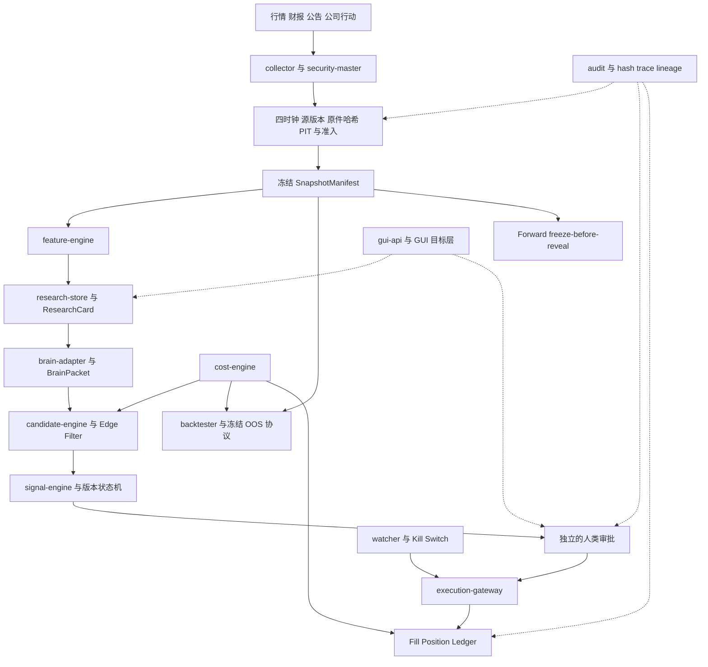

# MetaSurvey 系统架构与现状

正式交接文档是主要 Source of Truth；已确认迁移基线和人类逐轮决策是工程执行依据。本文是导航地图，不新增策略规则。参考 [正式原文](../specifications/V1-Engineering-Handoff.md)、[P0](../P0-Gate-Review.md)、[最新集成](../backtest-5y-integration/Acceptance-Report.md)。

## 目标与当前实现

图展示目标连接；不表示每条真实链已运行。LLM 的 APPROVE 不等于 user approval。CORE_40 / EVENT_3 / RESEARCH_6_18M 在 namespace 与合同层分离，V5 保留为 LEGACY_EXPERIMENT。

| 目标模块 | 当前代码入口 | 当前边界 |
|---|---|---|
| collector | `src/data/source.mjs`、`real-slice/`、`wave_h/collector.py`、`backtest_5y/collectors.py` | staging/原件元数据/有界采集与工程门禁；技术响应不等于 license/PIT |
| security-master | `src/data/security.mjs`、`contracts/v1/SecurityIdentity.schema.json` | 身份与版本语义；全历史状态闭环未证明 |
| feature-engine | `wave_c/`、`wave_d/`、`wave_e/`、`backtest_5y/strategy.py` | 当前观察诊断；完整 family 正式决策 NOT_COMPUTABLE |
| research-store | `src/closure/store.mjs`、`wave_c/`、`migrations/` | 合成闭环/本地沙盒；正式研究准入仍受阻 |
| candidate-engine | `src/p1a/core-skeleton.mjs`、`src/p1a/edge.mjs` | skeleton/Edge 工程合同；不产生真实选股授权 |
| signal-engine | `src/closure/`、`contracts/v1/SignalEvent.schema.json` | 版本、namespace、审批绑定；未启用真实信号执行 |
| cost-engine | `src/cost/index.mjs`、`src/baseline/ledger.mjs`、`backtest_5y/economics.py` | Decimal/integer money、最低佣金/可支付性；真实费用仍 UNSET_REQUIRED |
| backtester | `wave_f/backtest.py`、`dual_track/history.py`、`backtest_5y/` | Lite 为诊断；正式 OOS/Walk-forward BLOCKED |
| watcher | `wave_h/`、`wave_hb/` | 有界准备/门禁；未启用自动行情监控或调度 |
| brain-adapter | `src/closure/export.mjs`、`src/closure/import.mjs`、`src/closure/consumer.mjs` | fixture 手工导入导出；云端真实研究导出仍 BLOCKED |
| execution-gateway | `src/paper/index.mjs`、`src/baseline/gates.mjs` | 纸面交易与生产阻断；没有真实券商执行 |
| gui-api | `workbench/server.py` 与 `workbench/static/` | 六页本地只读界面、固定文件GET接口；无任务执行/审批/订单。见[界面验收](../workbench-v0/Acceptance-Report.md) |
| audit | `src/p1a/audit.mjs`、`dual_track/audit.py`、`integration_review/` | hash/trace、保全、失败保留、Gate/报告索引 |

## 跨模块合同与数据库

[contracts/v1](../../contracts/v1) 的 16 项原生合同保持 1.0.0：SecurityIdentity、DataEnvelope、SnapshotManifest、FeatureSet、AccountProfile、CostEstimate、ResearchCard、BrainPacket、CandidateEligibility、SignalEvent、Approval、OrderIntent、Fill、LedgerEntry、BacktestResult、AuditEvent。required/enum/单位/时区/版本/哈希和阻断语义见 [P0 合同说明](../contracts-v1.md) 与 schema；未确定真实参数保持 UNSET_REQUIRED。

其他阶段采用独立扩展目录，避免覆盖原生合同。[contracts/backtest-5y](../../contracts/backtest-5y) 六 DTO 为 1.0.1-candidate；[待解决字段与消费者审查](../backtest-5y-integration/Remaining-Contract-Gaps-v1.json) 尚未关闭。源合同是权威，目录地图不替代 schema。

[migrations](../../migrations) 001–006 不改旧 checksum。raw/adjusted 与 adjustment version 分离，财报 revision 追加保全；PIT 保留 event_time/published_at/available_at/retrieved_at，交易对象绑定 mode/account/strategy namespace。空库 migration 和保全门禁可合成验证；运行状态数据库和历史原件在本机。

## 双线协作与当前真实限制

主控维护共享合同、策略版本、Forward 预测和最终集成。历史专项在独立 worktree 开发，只有经主控审核的 sidecar 进入主控代码；公开仓库是主控已集成版本的快照，专项未合并工作不会被冒充为已验收成果。

Frozen StrategySpec 的两 family 未改变：[冻结规格](../wave-f/Frozen-StrategySpec-v1.json)。五年/1260 sessions、100 complete trades 是预注册目标，不是达成统计。36m 训练、12m 验证、6m sealed test、6m 滚动、purge/embargo=40 的协议在 PIT、真实日期化费用和窗口证据不足时不执行正式回测。

Forward Day0 原件保全，揭晓必须读取真实当日原件和单独签名授权；登记公钥或签名工具测试不能替代 Capture/Review/Forward 的实际授权链。实际天数仍为 0。公开仓库、合成 CI 绿灯和诊断命中率都不能开启真实资金执行。
