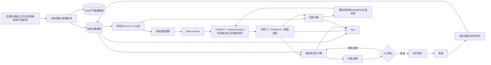

# A股交易系统重构工程交接文档：云端“大脑”与本地“眼睛和手”

## 执行摘要与交付清单

本次改造的核心是把“研究决策”和“数据执行”彻底拆开：ChatGPT + Deep Research负责市场、板块、公司、赔率与最终交易判断；本地小模型 + Codex负责采集、数据库、回测、信号、盯盘和执行准备。首版默认人工确认、费用先行、策略隔离、全链路可回放，不以“每天必须交易”为目标。

**V1.0 最小交付清单**

| 交付物        | 必须包含                                                     | 验收结果                                |
| ------------- | ------------------------------------------------------------ | --------------------------------------- |
| 数据库 Schema | 行情、证券主数据、公告、财务、事件、特征、研究卡、信号、成交、费用、回测、审计表 | 可从空库重建；字段有版本、时间与来源    |
| 数据采集器    | 交易所/官方披露、券商账户与成交、行情样例、公告样例          | 有断点续传、重试、校验、原始数据留档    |
| 交易成本引擎  | 佣金、最低佣金、印花税、经手费、其他券商实际收费、滑点       | 可逐笔与真实券商交割单对账              |
| 回测引擎      | Core 中期系统与 Event 短线系统隔离；撮合、T+1、涨跌停、停牌、费用、滑点 | 同一快照+配置重复运行结果完全一致       |
| 候选池与评分  | S/A/B/C/X、硬排除规则、Edge Filter、信号状态机               | 配置化，不把阈值写死在业务代码          |
| Brain Packet  | 本地系统提交给 ChatGPT/Deep Research 的标准 JSON/Markdown 数据包 | 任一历史决策可重放                      |
| 交易卡        | 研究、价格、交易、概率四层                                   | 每个可交易标的均有失效条件与成本后 Edge |
| 盯盘与通知    | 实时触发、去重、限频、过期、数据陈旧保护                     | 不重复轰炸；数据异常时 fail-closed      |
| GUI 原型      | 仪表盘、候选池、单股卡、盯盘、回测、配置                     | 能完成“发现→研究→等待→触发→确认→复盘”   |
| 运维与文档    | Docker/服务编排、日志、监控、备份、权限、回滚、测试          | dev/paper/prod 完全分离                 |

现有系统不是推倒重来。已经存在“行业筛选→公司筛选→深研→冻结计划→程序撮合→逐笔核账”的重要骨架，而且已经做过历史信息截止、隔离研究、冻结后再揭示未来行情和账本复核；这些应保留。当前 `sector-swing40-v5` 的已结算样本只有14个交易日、4轮完整交易，净收益为 -2.0886%，显式税费49.86元，样本远不足以证明策略有效；它更适合作为新系统的工程基线与反例库。fileciteturn0file0

真正需要改变的是**决策中心和目标函数**：旧材料里既有6—18个月产业趋势研究，也有尾盘潜伏、次日接力，还曾针对5000元账户按“一手是否买得起”筛股；这些思想分别有价值，但不能继续被一个评分、一个持仓和一个止损体系混在一起。fileciteturn0file1 fileciteturn0file3 fileciteturn0file5

## 目标边界与总体架构

**最终目标不是“AI推荐几只股票”，而是建立一套有状态、可验证、费用后有效的研究交易系统。** 系统最终应回答五件不同的事：

> 市场现在适不适合承担风险？  
> 哪些板块值得研究？  
> 哪些公司长期逻辑最好？  
> 哪些好公司现在具有足够好的价格与交易结构？  
> 即使判断错了，账户会损失多少？

旧中长期报告已经正确区分了“长期逻辑好”和“现在可以买”，并采用“产业/订单拐点→利润弹性→估值→趋势确认”的框架；新架构应把这一思想从报告文字升级成机器可执行的数据结构和状态机。fileciteturn0file2

### 当前需求基线

| 项目               | 当前定义                                                    |
| ------------------ | ----------------------------------------------------------- |
| 主要市场           | A股                                                         |
| 核心交易周期       | **约20—40个交易日，即约1—2个月**                            |
| 长期研究周期       | 6—18个月，可用于判断产业方向，但**不得直接决定20—40日买单** |
| 短线策略           | 独立保留为 Event 策略，不得影响 Core 中期持仓               |
| 当前实际账户规模   | **未指定**                                                  |
| 目标单笔金额       | **未指定**                                                  |
| 每月交易频率       | **未指定**                                                  |
| 最大账户可接受回撤 | **未指定**                                                  |
| 单笔最大风险       | **未指定**                                                  |
| 单行业最大暴露     | **未指定**                                                  |
| 是否融资融券       | **未指定**                                                  |
| 是否允许自动下单   | **未指定；V1 默认禁止，必须人工确认**                       |
| 券商佣金率         | **未指定**                                                  |
| 券商最低佣金       | **未指定**                                                  |
| 滑点实测值         | **未指定，先用保守模拟值并持续校准**                        |
| 主要优化目标       | 费用后收益、20—40日 MAE 较低、MFE 较高、收益/回撤比高       |
| “一个月不跌”       | 作为优化目标，**不能作为保证条件**                          |

这里尤其不能把历史实验中的1万元虚拟本金、早期报告中的5000元或6000元账户直接当成当前账户参数。它们只能作为测试配置。新系统必须把账户能力抽象为 `account_profile`，从此**研究模型不允许自行猜账户大小**。现有5000元研究甚至有表格明确采用“买一手、不含交易费用”的估算，这恰恰是V1必须消除的工程缺口。fileciteturn0file4

建议建立三个逻辑空间，但只有前两个属于交易策略：

| namespace        |    时间尺度 | 作用                                   | 是否产生订单 |
| ---------------- | ----------: | -------------------------------------- | ------------ |
| `RESEARCH_6_18M` |    6—18个月 | 产业周期、竞争格局、盈利弹性、长期估值 | 否           |
| `CORE_40`        | 20—40交易日 | 用户核心持仓系统                       | 是           |
| `EVENT_3`        |   1—3交易日 | 尾盘潜伏、事件、接力、短期资金行为     | 独立产生     |

原尾盘报告采用尾盘条件、次日9:30—10:00确认、短距离认错位等规则，这与20—40交易日系统的统计问题完全不同，因此只能共享底层数据，不能共享止损、评分或持仓状态。fileciteturn0file5

### 总体职责边界



这里要坚持一条工程纪律：

**本地小模型可以“理解数据”，但不能暗中改变规则；Codex可以写和维护程序，但生产规则的修改必须形成版本；ChatGPT + Deep Research可以做判断，但它的判断必须落成结构化交易卡，不能直接把自然语言变成券商指令。**

V1建议使用 `MANUAL_EXPORT` Brain 模式：本地生成一个研究包供你上传/提交给 ChatGPT，再把最终结构化结论导回本地。以后再做 `API_ORCHESTRATED`。这样不会为了“自动化漂亮”而过早把云端推理与真实交易账户绑死。

证券市场程序化交易监管已经把“通过计算机程序自动生成或者下达交易指令”纳入程序化交易定义；证监会规则自2024年10月8日起实施，上交所、深交所实施细则自2025年7月7日起实施，上交所规则明确个人投资者也属于可能适用的程序化交易投资者。因此首版默认“程序发现机会、人工确认下单”比直接做自动交易更稳妥；未来自动化前需按券商、账户与交易所规则确认报告和接入义务。citeturn8search6turn8search2turn8search15

## 模块接口与数据规范

### 工程模块清单

| 模块                 | 核心职责                            | 输入                | 输出/接口               | 关键字段                                                | 更新频率               | 延迟与故障策略                       |
| -------------------- | ----------------------------------- | ------------------- | ----------------------- | ------------------------------------------------------- | ---------------------- | ------------------------------------ |
| `collector` 数据采集 | 拉取、增量更新、原文归档            | API/文件/feed       | Raw + normalized events | `source_id,event_time,available_at,retrieved_at,sha256` | tick/分钟/EOD/事件驱动 | 自动重试；失败不得用旧数据冒充新数据 |
| `security-master`    | 证券代码、板块、交易状态、公司行动  | 交易所/结算数据     | `/security/{symbol}`    | `list_date,board,status,lot_size,price_limit`           | 每日+事件              | 交易前必须最新                       |
| `feature-engine`     | MA、ATR、量能、相对强弱、估值百分位 | 标准行情/财务       | `features_eod`          | `ma20,ma60,atr20,vol_ratio,rs20`                        | EOD；必要时分钟        | EOD完成后5分钟内                     |
| `research-store`     | 保存证据、研究卡与版本              | 公告/新闻/Brain结果 | `/research/cards`       | `evidence_ids,thesis,invalidation,grade`                | 事件/研究时            | 永久保留历史版本                     |
| `candidate-engine`   | 硬过滤+候选预筛                     | features/account    | `/candidates`           | `strategy_id,raw_score,affordable`                      | 日终+重大事件          | 数据缺失则降级或排除                 |
| `signal-engine`      | 确定性检查触发条件                  | card + live data    | `/signals`              | `rule_id,state,triggered_at,expires_at`                 | 实时或1—5秒轮询        | p95建议≤2秒；>5秒标记陈旧            |
| `cost-engine`        | 真实费用和模拟费用                  | broker config/fill  | `/cost/estimate`        | `commission,tax,slippage,total_bps`                     | 每次候选/订单/成交     | 未配置关键费用则禁止实盘             |
| `backtester`         | PIT回测、撮合、账本、费用           | snapshot+rules      | `backtest_runs`         | `run_id,data_hash,config_hash`                          | 离线                   | 必须确定性重放                       |
| `watcher`            | 盯盘、数据健康、风险检查            | live data/signals   | notifications           | `freshness,dedupe_key,severity`                         | 实时                   | feed断连自动禁用新买信号             |
| `brain-adapter`      | 生成Brain Packet、导入结论          | local data          | JSON/Markdown           | `as_of,decision_cutoff,evidence`                        | 按需                   | 不传API密钥/账户身份信息             |
| `execution-gateway`  | 订单准备、人工确认、成交回报        | approved decision   | broker order            | `client_order_id,approval_id`                           | 交易时                 | V1禁止无确认自动下单                 |
| `gui-api`            | 前端统一API                         | DB/services         | REST/WebSocket          | `trace_id,user_role`                                    | 实时                   | 页面不可直接访问broker secret        |
| `audit`              | 记录全部规则、模型、人工动作        | all services        | append-only log         | `actor,action,before,after,hash`                        | 实时                   | 不允许业务用户覆盖历史               |

**数据时钟统一使用 `Asia/Shanghai`，数据库落地同时保存 UTC。** 历史验证系统已经证明，仅保留一个“日期”不足以防未来泄漏；应继续区分 `event_time`、`published_at`、`available_at` 和 `retrieved_at`。旧系统对截止时点、未来标题泄漏和冻结前后分离已有比较成熟的实践，应该直接迁移。fileciteturn0file0

### 建议数据库模式

交易核心字段不要全部塞进一张“股票表”。至少拆为：

| 表                   | 主键/唯一键                         | 核心字段                                                     |
| -------------------- | ----------------------------------- | ------------------------------------------------------------ |
| `security_master`    | `symbol,effective_from`             | `exchange,name,board,lot_size,status,st_flag,list_date,delist_date` |
| `bars_1d`            | `symbol,trade_date`                 | `open,high,low,close,preclose,volume,amount,raw_or_adj`      |
| `bars_1m`            | `symbol,ts`                         | OHLCV、amount、session                                       |
| `orderbook_l2`       | `symbol,ts,seq`                     | bid/ask levels、orders、trades；可选                         |
| `corp_actions`       | `symbol,action_id`                  | 分红、送转、配股、除权日                                     |
| `announcements`      | `announcement_id`                   | `title,published_at,available_at,raw_uri,sha256`             |
| `financials`         | `symbol,period,statement_type`      | 财务字段、单位、同比、披露时间                               |
| `news_events`        | `event_id`                          | `entity,event_type,sentiment,source,published_at,confidence` |
| `sector_membership`  | `symbol,sector_id,effective_date`   | PIT行业成员关系                                              |
| `features_eod`       | `symbol,trade_date,feature_version` | 均线、ATR、量价、RS、估值百分位                              |
| `research_evidence`  | `evidence_id`                       | 来源、原文摘要、时间、可信等级                               |
| `research_cards`     | `card_id,version`                   | grade、score、scenario、trigger、invalidation                |
| `signal_events`      | `signal_id`                         | strategy、state、rule、触发价、时间                          |
| `orders_* / fills_*` | order/fill id                       | 模拟和真实分表                                               |
| `positions`          | `account_id,strategy_id,symbol`     | qty,cost,realized/unrealized P&L                             |
| `account_snapshots`  | `account_id,ts`                     | cash,equity,exposure                                         |
| `backtest_runs`      | `run_id`                            | `data_hash,rule_version,cost_version,result`                 |
| `strategy_metrics`   | `run_id,stratum`                    | 净收益、回撤、MAE/MFE等                                      |
| `config_versions`    | `config_id,version`                 | YAML内容、hash、发布者                                       |
| `audit_log`          | `audit_id`                          | actor/action/timestamp/before/after/hash                     |

原始HTML、PDF、JSON、CSV不要只把解析结果放数据库。建议：

```text
/object-store/
  raw/
    exchange/date=YYYY-MM-DD/...
    disclosure/symbol=XXXXXX/...
    broker/account_hash=.../...
  snapshots/
    snapshot_id=...
  backtests/
    run_id=...
```

每个原文件保存 `sha256`，便于几年后证明当时模型到底看了什么。

### 数据源优先级

顺序必须固定，不能因为某个爬虫方便就倒过来。

| 优先级 | 数据                                 | 首选                              | 替代原则                                     |
| ------ | ------------------------------------ | --------------------------------- | -------------------------------------------- |
| P0     | 真实委托、成交、费用、现金、持仓     | **券商官方API/交割单**            | 不允许第三方行情推断成交                     |
| P0     | 交易日历、证券状态、涨跌停、公司行动 | **交易所/中国结算**               | 第三方只能缓存                               |
| P0     | 公告、定期报告                       | **交易所信息披露、公司正式公告**  | 新闻摘要不得替代原文                         |
| P1     | L1行情                               | 券商正式行情/交易所授权feed       | 必须记录供应商和时间戳                       |
| P1     | Level-2/逐笔                         | 交易所授权/券商授权源             | 无授权则不抓取、不保存                       |
| P1     | 行业、商品、产业数据                 | 官方机构/行业协会/交易所/公司披露 | 记录口径                                     |
| P2     | 主流新闻                             | 合法授权或允许使用的主流媒体      | 用于发现事件，关键结论回到P0/P1验证          |
| P2     | “主力资金流”等衍生字段               | 数据商                            | 必须保存算法供应商，不能当作真实资金账户流水 |

上证所信息网络官方目前提供Level-1和Level-2产品；Level-2包含十档盘口、第一档前50笔订单以及逐笔成交/订单关联等信息，并采用低延迟行情系统。其行情还有明确的展示与非展示授权体系，因此工程上应优先接券商/授权数据源，而不是爬取一个展示网页后长期批量再利用。citeturn9search12turn9search17turn9search15

### 历史深度建议

`CORE_40` 至少需要跨越多个风格与牛熊阶段，而不是只验证一段强势行情。

| 数据         |       V1最低 |                  推荐 |
| ------------ | -----------: | --------------------: |
| 日线OHLCV    |          5年 |              上市以来 |
| 财务与公告   |          5年 |                8—10年 |
| 行业成员历史 |          5年 |     尽可能完整PIT历史 |
| 分钟线       |          2年 |                 3—5年 |
| Tick/L2      |        6个月 | 1—2年，取决于授权成本 |
| 新闻/事件    |          2年 |                 3—5年 |
| 券商真实成交 | 从启用起全部 |        永久保存脱敏版 |

### 数据质量门禁

进入评分和回测前，建议统一跑：

```yaml
data_quality:
  required_completeness: 0.999
  reject_future_available_at: true
  reject_duplicate_primary_key: true
  enforce_ohlc:
    high_gte_max_open_close: true
    low_lte_min_open_close: true
  volume_non_negative: true
  raw_adjusted_prices_separated: true
  corporate_action_reconciled: true
  security_status_required: true
  source_timestamp_required: true
  stale_live_data_block_seconds: 5
```

一旦关键字段失败，不是“让模型猜一下”，而是：

```text
DQ_FAIL -> candidate.tradeable = false
```

这会比再加一个聪明模型有效得多。

## 策略分层、成本与回测规范

### 首先修掉现有坏习惯

| 坏习惯                            | 为什么有害                                           | V1替代实现                                                   |
| --------------------------------- | ---------------------------------------------------- | ------------------------------------------------------------ |
| 45.20、45.50、45.80式微小分档     | 小账户里价格改善可能小于新增佣金、滑点和一手限制     | 价格区间只在统计意义上存在；拆单前先过 `incremental_edge_filter` |
| 把“好公司”当“可以买”              | 研究质量与当前赔率不同                               | `quality_score` 与 `timing_score` 分离                       |
| 评分高就给买单                    | 分数不是上涨概率                                     | 等级必须同时过成本、风险、数据、组合约束                     |
| 先给买价，最后再算手续费          | 会制造账面有Edge、实际没Edge的伪信号                 | `cost_engine` 在候选阶段先运行                               |
| 一手买得起按“不含交易费”计算      | 可能导致现金不足或低估成本                           | `affordable_qty()`必须使用 all-in cost；旧报告中的此口径废止。fileciteturn0file4 |
| 中长期仓位被次日接力信号洗掉      | 时间尺度冲突                                         | `strategy_id`强隔离；Event无法修改Core仓位                   |
| 用6—18个月目标价证明未来1个月安全 | 时间期限错配                                         | 每张卡分别保存 `research_horizon` / `trade_horizon`          |
| 止损只有一个固定百分比            | 可能把正常噪声当逻辑失效，也可能对真正坏消息反应过慢 | `price_stop` + `thesis_invalidation` 双机制                  |
| 每天必须选股票                    | 强迫系统降低标准                                     | `S_count=0` 完全正常                                         |
| 把主力资金流当真实现金流          | 数据商算法口径可能不同                               | 标记 `derived_vendor_metric`                                 |
| 只看最终收益优化参数              | 极易过拟合                                           | Walk-forward + OOS + 参数敏感性面                            |
| AI发现反证但仍照买                | 当前历史系统已有这种缺陷                             | `hard_negative_rules`让严重反证直接降级/禁买。fileciteturn0file0 |

**关于微小分档，代码应直接限制：**

```python
def allow_extra_tranche(
    expected_price_improvement: float,
    qty: int,
    incremental_fees: float,
    incremental_slippage: float,
    safety_multiple: float = 3.0,
) -> bool:
    benefit = expected_price_improvement * qty
    friction = incremental_fees + incremental_slippage
    return benefit >= safety_multiple * friction
```

除此之外再加：

```yaml
execution:
  max_entry_tranches_core40: 2
  allow_micro_ladders: false
  extra_tranche_min_incremental_edge_bps: 50
```

这意味着45元附近的股票不会因为“看起来精细”而给出45.2、45.5、45.8三档。系统更可能输出：

> 45.00元：A类，当前不交易。  
> 41.80—42.50：回踩买入触发区。  
> 47.20以上且放量1.5倍：趋势确认触发。  
> 42.50—47.20：无交易区。

**“什么都不做”也是一个有效动作。**

### 交易成本模型必须成为一等公民

截至目前，上交所现行收费页面列示A股竞价交易经手费为成交金额的0.00341%双向收取；证券交易印花税自2023年8月28日起实施减半征收。券商实际佣金、最低佣金以及某些交易所费用是否已包含在经纪佣金中，则依你的账户合同和交割单而定，因此**佣金率与最低佣金必须标“未指定”，禁止拍脑袋填5元最低佣金**。citeturn8search16turn12search9

费用引擎推荐设计为**生效日期版本表**，不要把税率写死：

```yaml
cost_model:
  version: "cn_a_share_v1"

  broker:
    commission_rate: UNSET_REQUIRED
    commission_min_per_order: UNSET_REQUIRED
    includes_exchange_handling_fee: UNSET_REQUIRED
    includes_other_regulatory_fees: UNSET_REQUIRED

  statutory:
    stamp_tax_sell_rate:
      value: 0.0005
      effective_from: "2023-08-28"
      verify_on_startup: true

    exchange_handling_fee_rate:
      value: 0.0000341
      side: BOTH
      effective_from: "2023-08-28"

    transfer_and_other_fees:
      mode: BROKER_STATEMENT_OR_OFFICIAL_RATE_TABLE

  slippage:
    base_bps_core40: 10
    stress_bps_core40: 30
    calibration_source: REAL_FILLS
```

其中0.05%的卖出印花税是基于此前证券交易印花税单边征收制度与2023年“减半征收”后的当前模型值；生产系统应按生效日期从官方/券商费率表校验，不应把本文数字永久硬编码。交易所经手费当前官方页面仍列0.00341%双向。citeturn12search9turn8search16

统一公式：

\[
Notional = Price \times Qty
\]

\[
BuyCost = Commission_{buy}+ExchangeFees_{buy}+OtherFees_{buy}+Slippage_{buy}
\]

\[
SellCost = Commission_{sell}+ExchangeFees_{sell}+OtherFees_{sell}+StampTax+Slippage_{sell}
\]

\[
NetPnL = SellNotional-BuyNotional-BuyCost-SellCost
\]

若券商存在最低佣金：

\[
Commission=\max(Notional \times commission\_rate,\ commission\_min)
\]

但这两个参数当前都是**未指定**。

最重要的工程字段是：

```text
commission_source
commission_rate
commission_min
exchange_fee_included
regulatory_fee_included
tax_rule_version
slippage_model_version
estimated_round_trip_cost_bps
actual_round_trip_cost_bps
```

每周运行：

```text
模型估计费用 - 实际交割费用
```

出现无法解释的偏差，就禁止继续把回测净收益视为可信。

### Minimum Edge Filter

不要再问“这只票会不会涨”，先问：

> **它的预期优势是否大到足够支付交易摩擦、预测误差和风险？**

建议：

\[
EV_{gross}
= p_{up}R_{up}
+ p_{flat}R_{flat}
+ p_{down}R_{down}
\]

\[
NetEdge
= EV_{gross}
- RoundTripCost
- UncertaintyBuffer
\]

V1回测初始值，不是永恒真理：

```yaml
edge_filter:
  CORE_40:
    min_net_edge_bps: 400
    min_edge_to_cost_ratio: 5.0
  EVENT_3:
    min_net_edge_bps: 120
    min_edge_to_cost_ratio: 8.0
```

例如交易往返摩擦为35bp，那么Core策略至少不能因为预期优势只有40—80bp就交易；一旦优势与摩擦同量级，这就是“给券商打工”的典型信号。

这些阈值必须用历史留出样本和真实paper-trading校准，而不是为了增加成交次数向下调。

### S/A/B/C/X 不应只是一个总分

建议同时计算：

```text
fundamental_score  0-100
sector_score       0-100
catalyst_score     0-100
trend_score        0-100
valuation_score    0-100
liquidity_score    0-100
evidence_score     0-100
risk_score         0-100  # 越高越危险
timing_score       0-100
```

研究基础分：

\[
RawScore =
0.25F+0.20S+0.15C+0.15T+
0.10V+0.10L+0.05E
\]

风险修正：

\[
RiskAdjustedScore=RawScore-0.20\times RiskScore
\]

成本惩罚建议不要单独凭感觉扣2分，而直接根据成本占预期收益的比例：

\[
CostPenalty=
\min
\left(
15,\
100\times
\frac{RoundTripCostPct}
{\max(ExpectedReturnPct,0.5\%)}
\right)
\]

\[
FinalScore=RiskAdjustedScore-CostPenalty
\]

V1建议分层：

| 等级  | 量化条件示例                                                 | 含义                                  | 系统动作                               |
| ----- | ------------------------------------------------------------ | ------------------------------------- | -------------------------------------- |
| **S** | Final ≥85；Research ≥85；Timing ≥80；Evidence ≥80；Edge Filter通过；无硬风险 | 研究、价格、时点、费用全部通过        | **可以提交人工确认**，绝不等于“无脑买” |
| **A** | Final 78—84；Quality高，但Timing<80或触发尚未出现            | 优质股票、价格未到                    | 实时盯盘                               |
| **B** | Final 68—77                                                  | 有催化/趋势，但赔率或证据存在明显缺口 | 条件观察，默认不主动下单               |
| **C** | Final 55—67                                                  | 有研究价值但交易优势不足              | 日报观察                               |
| **X** | <55或任何Hard Block                                          | 排除                                  | 禁止生成买单                           |

Hard Block优先于分数：

```yaml
hard_blocks:
  - data_quality_failed
  - suspended
  - trading_status_unknown
  - material_thesis_invalidated
  - financial_report_integrity_risk
  - expected_edge_le_cost
  - insufficient_liquidity
  - unavailable_official_evidence
  - strategy_horizon_mismatch
```

这样就解决了现有系统“文字里写了重大反证，最终仍然因为板块故事和目标空间批准买入”的缺陷。fileciteturn0file0

### 信号应是可复现的逻辑表达式

例如Core回踩型：

```yaml
signal: CORE_PULLBACK
requirements:
  close_above_ma60: true
  ma60_slope_20d_gt: 0
  sector_rs20_vs_benchmark_gt_pct: 3
  pullback_distance_to_ma20_atr_lt: 1.0
  volume_3d_vs_vol20_lt: 0.80
  confirmation:
    close_gt_prev_3d_high: true
  cost_edge_filter: PASS
```

突破型：

```yaml
signal: CORE_BREAKOUT
requirements:
  close_gt_60d_high_pct: 0.5
  volume_ratio_20d_gte: 1.5
  sector_relative_strength_positive: true
  max_extension_from_breakout_pct: 3.0
  catalyst_not_expired: true
  cost_edge_filter: PASS
```

估值条件应按行业区别处理。资源周期股不能只用PE；成长股可以结合Forward PE、PEG、盈利上修；周期资源应结合商品价格情景、产量、成本曲线和EV/EBITDA。旧中长期研究已经很好地识别了“周期价格/订单→利润弹性→趋势”的关系，应保留这种产业链方法，而不是把所有股票塞进同一个PE模板。fileciteturn0file1

### 回测必须改变目标函数

现有历史系统已经实现了冻结决策、条件撮合与整数对账，但因为主要依赖日线代理，无法知道真实盘口队列、第一次触价时刻和盘中真实可成交数量；它自己也明确将成交标记为 `daily_proxy_conditional_fill_not_observed_auction`。这非常重要：以后不能把日线条件成交当成“历史上真的成交了”。fileciteturn0file0

标准流程应为：

```text
冻结数据快照
→ Point-in-Time特征
→ 候选池
→ 评分
→ Brain决策
→ 信号
→ 执行模拟
→ 逐笔费用
→ 账本
→ 日净值
→ MAE/MFE
→ 分层统计
→ 参数敏感性
→ OOS验证
```

推荐同时输出三种撮合情景：

| 模型        | 用途                                 |
| ----------- | ------------------------------------ |
| Optimistic  | 上界，仅用于敏感性，不作为主报告     |
| Base        | 默认下一可执行时点+标准滑点+实际费用 |
| Pessimistic | 延迟、较高滑点、部分信号不成交       |

有分钟数据后，MAE/MFE使用分钟高低；只有日线时必须标注 `mae_resolution=1D`，避免产生虚假的精确度。

**每次回测必须输出：**

| 类别 | 指标                                                    |
| ---- | ------------------------------------------------------- |
| 收益 | Gross Return、Net Return、年化/区间收益                 |
| 费用 | 佣金、最低佣金影响、印花税、交易所/其他费、滑点、总摩擦 |
| 交易 | 交易数、换手率、平均持有天数、胜率                      |
| 盈亏 | 平均盈利、平均亏损、盈亏比、Profit Factor               |
| 风险 | Max Drawdown、最大单笔亏损、连续亏损                    |
| 路径 | MFE、MAE、MFE/MAE、进入盈利所需天数                     |
| 分层 | S/A/B/C/X分别的样本、胜率、净收益、MAE/MFE              |
| 信号 | pullback/breakout/event分别统计                         |
| 环境 | 牛/熊/震荡、行业强弱分层                                |
| 概率 | 若输出概率：Brier Score与可靠性校准                     |
| 数据 | `snapshot_id,data_hash,rule_version,cost_version`       |

尤其要增加：

\[
Efficiency = \frac{MFE}{|MAE|}
\]

以及：

\[
ReturnDrawdownRatio=
\frac{ExpectedNetReturn}{ExpectedMAE}
\]

因为你的真实目标并不是“选未来涨幅最大的票”，而是**选未来1—2个月上涨空间足够、但途中不容易让你承受巨大浮亏的票**。

“未来一个月完全不跌”无法保证；合理工程目标是把未来20个交易日的MAE概率分布显式化。例如：

```text
P(MAE <= 3%)
P(MAE <= 5%)
P(MAE > 8%)
Expected MAE
95% adverse scenario
```

这比一句“比较稳”有价值得多。

参数开发必须使用时间序列Walk-forward，留出期不参与调参。旧实验已经遇到开发样本看过后不能再称“未见留出样本”的问题，新系统应把这个教训写进框架，而不是只写在复盘报告里。fileciteturn0file0

## 交易卡、盯盘通知与界面设计

### 统一交易卡

交易卡是整个架构的**合同**：Deep Research可以写长报告，但本地程序最终只认卡中的结构化字段。

建议Schema：

```json
{
  "card_id": "CORE40_600XXX_20261005_v3",
  "symbol": "600XXX",
  "strategy_id": "CORE_40",
  "as_of": "2026-10-05T15:10:00+08:00",
  "decision_cutoff": "2026-10-05T15:00:00+08:00",
  "grade": "A",
  "scores": {
    "final": 82,
    "research": 89,
    "timing": 68,
    "risk": 27,
    "evidence": 91
  },
  "entry_rules": [],
  "invalidation_rules": [],
  "scenario_probs": {},
  "cost_assumptions": {},
  "evidence_ids": [],
  "data_snapshot_id": "sha256:...",
  "rule_version": "core40-v1.0"
}
```

**示例交易卡仅用于说明结构，不代表实际股票建议：**

| 层级     | 字段                   | 示例                                               |
| -------- | ---------------------- | -------------------------------------------------- |
| 基本信息 | 标的                   | `600XXX 示例股份`                                  |
| 研究层   | 行业逻辑               | 行业订单同比改善，公司利润弹性高于收入             |
| 研究层   | 支持证据               | 最近财报、正式订单公告、行业价格数据               |
| 研究层   | 最强反证               | 当前估值位于历史较高分位；行业订单若下修则逻辑弱化 |
| 研究层   | 未知项                 | 下一季度毛利率能否维持                             |
| 研究层   | 长期研究周期           | 6—12个月                                           |
| 价格层   | 当前价                 | 45.00元                                            |
| 价格层   | 回踩价值区             | 41.80—42.50元                                      |
| 价格层   | 趋势突破位             | >47.20元且成交量≥20日均量1.5倍                     |
| 价格层   | **无交易区**           | **42.50—47.20元**                                  |
| 价格层   | 追高禁区               | 突破点以上>3%不追                                  |
| 交易层   | 评级                   | A                                                  |
| 交易层   | 当前动作               | WAIT                                               |
| 交易层   | Core持有周期           | 20—40交易日                                        |
| 交易层   | 价格止损               | 39.60元，示例值                                    |
| 交易层   | 逻辑失效               | 订单/盈利预期下修且板块相对强弱转负                |
| 交易层   | 最大仓位               | **未指定，等待account_profile**                    |
| 交易层   | 往返费用               | 根据真实券商配置动态计算                           |
| 概率层   | 上行情景               | 40%，+12%～+20%                                    |
| 概率层   | 横盘情景               | 35%，-3%～+5%                                      |
| 概率层   | 下行情景               | 25%，-8%～-13%                                     |
| 概率层   | Expected MAE           | 需模型/回测给出                                    |
| 概率层   | Net Edge               | 费用后计算                                         |
| 校准     | probability_calibrated | false，未达到校准样本前必须明确标记                |

这张表最关键的地方不是47.20，而是：

> **45.00附近没有因为AI“需要给建议”而出现45.20、45.50这种假精细买点。**

### 通知与盯盘状态机

信号不要每秒重复“达到买点”。建议：

```text
WATCHING
   ↓
ARMED
   ↓ 条件满足
TRIGGERED
   ↓
ACKNOWLEDGED
   ├─ APPROVED → EXECUTION_READY → EXECUTED
   ├─ WAIT → WATCHING
   ├─ REJECTED
   └─ EXPIRED
```

优先级：

| 级别 | 事件                                             | 推送规则                   |
| ---- | ------------------------------------------------ | -------------------------- |
| P0   | 止损/逻辑失效、券商断线、数据源失效、Kill Switch | 立即，持续至确认           |
| P1   | S/A入场触发、持仓重大公告、突破/回踩完成         | 立即；同股同信号15分钟去重 |
| P2   | 评级改变、板块强弱切换、催化更新                 | 每事件一次                 |
| P3   | 日报、观察池变化                                 | 收盘统一摘要               |

`dedupe_key`：

```text
{strategy_id}:{symbol}:{signal_type}:{rule_version}
```

一条买入触发通知至少包含：

```text
[CORE_40 / P1]
股票：600XXX
评级：A → Triggered
现价：42.18
触发：42.50以下回踩 + 缩量 + 重新突破3日高点
20日量比：1.36
板块RS20：+6.2%
预计往返费用：xx bp
费用后Net Edge：+x.x%
预计MAE：x.x%
当前仓位：0
数据延迟：0.8s
证据更新时间：2026-10-05 14:58 CST
交易卡：CARD_ID
动作：提交ChatGPT复核 / 不自动下单
```

这里推荐一个很重要的协作模式：

**盯盘程序负责判断“规则有没有满足”，不负责重新解释公司基本面。**

信号满足后，它把最新状态打包给ChatGPT：

```json
{
  "request_type": "TRIGGER_REVIEW",
  "strategy_id": "CORE_40",
  "card_id": "...",
  "trigger_id": "...",
  "current_market": {},
  "position_state": {},
  "cost_estimate": {},
  "new_events_since_card": [],
  "data_quality": "PASS"
}
```

ChatGPT最终只允许返回：

```json
{
  "decision": "APPROVE | WAIT | REJECT",
  "max_notional": null,
  "entry_rule": "...",
  "invalidation_rule": "...",
  "expires_at": "...",
  "reason_codes": []
}
```

`max_notional=null` 时就是因为你的真实账户风险参数仍**未指定**，不能让模型自己猜。

### 自动下单的边界

V1流程：

```text
信号触发
→ ChatGPT/Deep Research或聊天复核
→ 用户看到交易卡
→ 用户点击“批准”
→ execution-gateway生成订单
→ 再显示最终费用/数量
→ 用户确认
→ 券商API
```

禁止：

```text
LLM自由文本
→ 直接券商API
```

从监管定义看，程序自动选择证券/时机并自动生成或下达指令已经属于程序化交易范畴。上交所当前还对每秒300笔以上或单日20000笔以上申报行为进行重点关注并要求额外信息；你的系统完全没有必要靠近这种速度级别。citeturn8search2turn9search18

### GUI 页面设计

**仪表盘**

顶部不是“今天推荐股票”，而是：

```text
市场风险状态
Core可承担风险程度
现金/持仓
S/A/B候选数
今日新触发
持仓MAE
数据健康
券商连接
系统模式：DEV / PAPER / PROD
```

核心交互：

`市场状态 → 点击板块 → 候选池 → 单股卡 → 盯盘`

**候选池**

列建议至少有：

```text
symbol
name
strategy
grade
final_score
research_score
timing_score
net_edge
expected_mae
edge_cost_ratio
sector_rs
trigger_distance_pct
one_lot_all_in_cost
portfolio_fit
next_catalyst
card_age
```

支持：

```text
只看A以上
只看20日MAE预计<5%
按费用后Edge排序
按距离触发位排序
排除已持同行业
显示“为什么不是S”
```

最后这个“为什么不是S”非常重要。例如：

> 研究89分，但Timing 63；当前价格比理想买点高7.8%，因此A，不允许买。

这比总分82更有解释力。

**单股交易卡**

左侧：

> 产业链 → 公司 → 盈利 → 估值 → 趋势。

中间：

> K线、MA20/60/120/250、成交量、触发区、失效位、无交易区。

右侧：

> S/A/B/C/X、Scenario、Net Edge、预计MAE、费用模拟器。

底部必须同时展示：

> 支持证据 / 最强反证 / 未知信息 / 最新公告。

**盯盘面板**

采用“条件”而不是“股票代码”做主行：

```text
示例股份
A
等待：回踩区+缩量+重新转强
当前完成度：3/4
剩余条件：成交量仍偏高
```

触发后出现：

```text
重新提交大脑
静音15分钟
延长观察
撤销交易卡
```

**回测报告页**

禁止只放一根漂亮净值曲线。至少同时显示：

> Gross vs Net净值；  
> Drawdown曲线；  
> Fees waterfall；  
> MFE/MAE散点；  
> S/A/B/C分层；  
> Signal类型分层；  
> 市场环境分层；  
> 参数敏感性热图；  
> OOS区域单独标识。

旧实验中4轮交易已有159元价格亏损之外再产生49.86元显式费用，这正说明费用必须在GUI里被当作绩效的一部分，而不是藏在附注里。fileciteturn0file0

**参数配置页**

分成：

```text
账户
券商费用
组合风险
策略
评分权重
信号
数据源
通知
回测
生产发布
```

生产修改需要：

```text
编辑 → Diff → 测试回放 → PAPER验证 → Publish → 生成config_version
```

不能直接在Python文件里改一个`0.8`然后重启。

## 部署运维与权限合规

### 推荐部署拓扑

V1不需要微服务宇宙，但应该把风险边界分开：

```text
postgres
object-store / minio
redis
collector
scheduler
feature-engine
candidate-engine
signal-engine
cost-engine
backtest-worker
brain-adapter
notifier
api
gui
execution-gateway
```

建议三个环境：

| 环境    | 数据              | 券商权限     | 用途     |
| ------- | ----------------- | ------------ | -------- |
| `dev`   | 历史/模拟         | 无           | 开发     |
| `paper` | 实时行情+虚拟账户 | 只读或模拟   | 前向验证 |
| `prod`  | 实时+真实账户     | 最小必要权限 | 真实运行 |

**dev代码绝不能拿到prod下单密钥。**

权限角色：

```text
research_read
data_admin
strategy_editor
trade_prepare
trade_approve
ops_admin
```

即使只有你一个人，也要让“生成订单”和“批准订单”成为两个软件动作，防止程序故障自行越权。

### 日志与审计

所有服务使用结构化JSON日志：

```json
{
  "timestamp": "...",
  "service": "signal-engine",
  "trace_id": "...",
  "strategy_id": "CORE_40",
  "symbol": "600XXX",
  "event": "SIGNAL_TRIGGERED",
  "config_version": "...",
  "data_snapshot_id": "...",
  "latency_ms": 428
}
```

真正需要长期不可变的是：

```text
谁改了策略
何时改
改前是什么
改后是什么
用什么数据测试
谁发布
哪个订单由哪个decision产生
```

这也能解决以后“到底是AI判断错，还是代码参数被改了”的归因问题。

### Kill Switch

下列任一情况自动切到：

```text
NO_NEW_ORDERS
```

建议包括：

```yaml
kill_switch:
  broker_connection_lost: true
  market_data_stale_gt_seconds: 5
  account_reconciliation_failed: true
  unexpected_position_detected: true
  cost_config_unset: true
  official_trading_status_unknown: true
  daily_loss_limit_breached: true       # 阈值未指定
  portfolio_drawdown_limit_breached: true # 阈值未指定
```

当前`daily_loss_limit`和`portfolio_drawdown_limit`必须保持 `UNSET_REQUIRED`，而不是沿用旧模拟账户的250元、400元计划亏损上限。旧参数属于历史实验，不是你的当前风险承诺。fileciteturn0file0

### 备份与回滚

数据库每天备份，原始证据对象存储做不可变版本；至少每月实际恢复一次备份，不能只验证“备份任务显示成功”。

每个生产版本绑定：

```text
git_commit
container_image_digest
db_schema_version
config_version
cost_version
feature_version
model_prompt_version
```

回滚的单位不是“把某个py文件换回来”，而是：

> 程序版本 + 配置版本 + Schema兼容版本。

### 数据版权和API

Level-2不是“网页上看得到就可以无限抓”。上证所信息网络有独立的Level-1、Level-2与非展示许可体系；因此数据库必须为每个外部源保存：

```text
license_type
allowed_use
retention_policy
redistribution_allowed
rate_limit
terms_version
```

生产环境禁止“为了补数据临时抓一个网站”。citeturn9search15turn9search22

### 自动交易合规

当前证监会、沪深交易所已经形成程序化交易的监管和报告框架，上交所实施细则目前显示为现行有效。个人投资者若未来让程序自动生成或下达真实交易指令，也不能因为资金规模小就默认“不属于程序化交易”。因此在打开 `AUTO_EXECUTE=true` 之前，必须由券商确认账户报告、接口和程序化交易适用要求。citeturn8search2turn8search6turn8search15

V1应强制：

```yaml
execution:
  mode: HUMAN_CONFIRM
  auto_execute: false
  live_trading_requires:
    - broker_capability_verified
    - cost_reconciliation_passed
    - program_trading_compliance_checked
    - paper_acceptance_passed
    - kill_switch_test_passed
```

### 模型本身也要设权限

Deep Research适合做：

> 行业研究、产业链、公司竞争力、财务、公告、多源证据、反证和催化。

不应该每5秒调用一次。

本地小模型适合：

> 新闻分类、实体匹配、公告预分类、异常检测、把原始数据整理成Brain Packet。

确定性程序适合：

> 算均线、费用、仓位、MAE/MFE、是否触发条件、是否超过风险限制。

这会显著降低模型成本。已有历史实验仅45个研究模型阶段就报告过约258万token，说明将“每个机械步骤都调用大模型”并不经济；深研究应在新公司进入核心池、重大事件、评级冲突和周期性复核时调用，而不是代替SQL和公式。fileciteturn0file0

## 里程碑、验收与最终交接

### 建议开发顺序

| 阶段         | 主要工作                                             |         预计工程量 | 验收门槛                           |
| ------------ | ---------------------------------------------------- | -----------------: | ---------------------------------- |
| 现状冻结     | 给现有代码、配置、数据库、策略做快照；列技术债       |              2—3天 | 可重建旧v5结果                     |
| 数据与Schema | 新表、PIT时间、raw store、官方源优先、broker账户模型 |              4—7天 | 同一数据不会因未来信息污染过去     |
| 成本引擎     | 券商费用配置、逐笔对账、Edge Filter                  |              2—4天 | 对账差异全部可解释                 |
| 策略隔离     | `CORE_40` / `EVENT_3` / `RESEARCH`                   |              3—5天 | 任一Event信号无法修改Core持仓      |
| 回测重构     | 分钟/日线撮合、三情景、净收益、MAE/MFE               |              5—8天 | 确定性重放                         |
| 评分与交易卡 | 双评分、S/A/B/C/X、硬排除、Brain Packet              |              4—6天 | 每个买信号均能解释为何不是其他等级 |
| 盯盘通知     | 状态机、去重、TTL、数据陈旧保护                      |              4—6天 | 无重复轰炸、断线不下新单           |
| GUI          | 六大页面和审批流                                     |              5—8天 | 完成端到端paper操作                |
| 前向PAPER    | 真实时间运行                                         | **至少20个交易日** | 无越权、无重复、账实一致           |
| PROD评审     | 决定是否接真实券商下单                               |               之后 | 未达到门槛则保持人工执行           |

这里不建议“先把GUI做漂亮”。最优先顺序应该是：

> **成本 → 数据时点 → 回测 → 策略隔离 → 评分 → 盯盘 → GUI → 自动化。**

因为你的核心痛点本来就不是缺一个好看的页面，而是：

1. 手续费没有进入决策函数；
2. AI把微小价差包装成精细买点；
3. 长期研究和短期执行混在一起；
4. 好股票与好买点没有彻底解耦；
5. 评分没有经过真实分层校准。

### V1配置文件建议

最终尽量让业务规则集中为：

```text
config/
  account.yaml
  broker_costs.yaml
  strategy_core40.yaml
  strategy_event3.yaml
  scoring.yaml
  hard_blocks.yaml
  data_sources.yaml
  alerts.yaml
  risk.yaml
```

例如：

```yaml
account:
  capital: UNSET_REQUIRED
  max_portfolio_drawdown_pct: UNSET_REQUIRED
  max_single_trade_loss_pct: UNSET_REQUIRED
  max_sector_exposure_pct: UNSET_REQUIRED
  max_positions: UNSET_REQUIRED

core40:
  holding_days_target: [20, 40]
  max_entry_tranches: 2
  allow_averaging_down: false

  grade:
    S: 85
    A: 78
    B: 68
    C: 55

  timing:
    S_min: 80

  edge:
    min_net_edge_bps: 400
    min_edge_cost_ratio: 5.0

  chase:
    max_breakout_extension_pct: 3.0

  probability:
    require_calibrated_for_position_sizing: true

production:
  execution_mode: HUMAN_CONFIRM
  fail_closed_on_missing_costs: true
  fail_closed_on_stale_data: true
```

### 验收标准

**数据验收**

关键交易字段完整率≥99.9%；任何`available_at > decision_cutoff`的信息进入历史研究包，测试直接失败。公司行动、停牌、涨跌停和证券状态必须能够Point-in-Time重建。

**费用验收**

随机抽取真实券商成交，做到：

> 数量、成交价、现金变化、佣金、税费、最终余额逐笔可解释到“分”。

存在无法解释的费用差异时，禁止升级到实盘。

**回测验收**

同一个：

```text
data_snapshot_id
+ strategy_config_hash
+ cost_model_version
+ code_version
```

运行两次，结果必须完全一致。

至少分别展示：

```text
Gross
Net
fees
slippage
win rate
payoff
max drawdown
MFE
MAE
S/A/B/C/X
```

不能只报“策略收益率”。

**S/A/B/C/X验收**

每个等级至少要有足够独立样本才允许修改评级阈值。建议在某一级累计**至少50笔完整OOS/Paper交易**以前，把其胜率和概率解释视为“探索性统计”，不要声称“85分意味着多少上涨概率”。

**Brain验收**

任何ChatGPT结论都能回答：

```text
你当时看到了什么？
数据截止到什么时候？
哪个公告支撑？
最强反证是什么？
为什么是A不是S？
为什么此时不买？
交易成本是多少？
判断失效后怎么办？
```

回答不了其中任何一个，就不能产生生产交易卡。

**Paper验收**

至少连续20个交易日满足：

```text
0 未授权真实订单
0 重复执行订单
0 使用陈旧行情产生的新入场
0 账实不明差异
100% 信号可追溯到rule_version
100% 交易可追溯到card_id/approval_id
```

盈利不是这一阶段唯一验收条件；先证明系统没有骗自己、没有错账、没有未来函数，再谈收益。

### 风险与合规底线

这个系统可以优化“未来1个月下跌概率较低、1—2个月收益回撤比较好”，但不能保证某只股票一个月不跌，更不能把S级解释为“不会亏”。正确输出应该是：

> **它为什么值得持有、最可能怎样赚钱、在什么条件下会错、错了大概会付出多少代价。**

自动下单方面，当前证券市场程序化交易规则已经覆盖自动生成或下达交易指令的行为，沪深交易所实施细则亦已生效，因此生产系统必须将程序化交易合规检查列为正式上线前置条件，而不是上线后补文档。citeturn8search6turn8search2turn8search15

数据方面，交易所授权行情尤其是Level-2存在明确授权与产品许可，应遵守数据源许可、API频率和再分发限制；本地数据库不能因为“仅个人使用”就默认所有抓取方式都合规。citeturn9search15turn9search17

回测方面，最大的风险不是代码报错，而是**结果看起来特别漂亮**：幸存者偏差、未来行业成分、财报披露时间错位、除权处理、调参看过留出样本、只选择成功版本、理想化成交，都能制造虚假的历史优势。现有历史系统已经为“截止时点过滤、先冻结后揭示、保留模型原回答和确定性核账”打下了很好的基础，这一部分应该成为新系统最坚决保留的资产。fileciteturn0file0

最终的职责边界应冻结为：

| 角色                        | 最终职责                                                     | 明确不做                               |
| --------------------------- | ------------------------------------------------------------ | -------------------------------------- |
| **ChatGPT + Deep Research** | 市场环境、行业研究、公司研究、反证、估值、S/A/B/C/X、交易卡、触发后的最终复核 | 高频抓数据、计算技术指标、直接操纵券商 |
| **本地小模型**              | 新闻/公告分类、实体识别、数据压缩、异常提示                  | 自己修改交易规则或偷偷提高评分         |
| **Codex智能体**             | 采集器、数据库、测试、回测、GUI、部署、监控、数据管线        | 在未经版本审批时在线调参               |
| **确定性策略程序**          | 指标、费用、Edge、触发、仓位限制、状态机                     | 用自然语言“灵活解释”规则               |
| **盯盘系统**                | 持续监视、触发、通知、数据健康                               | 因为快到买点就自行把A升级成S           |
| **用户**                    | 风险参数设定、真实资金授权、生产下单最终确认                 | 被系统逼迫“今天必须买一只”             |

**最终系统不应追求“AI每天更敢推荐股票”，而应追求“只有当研究质量、当前价格、趋势、催化、费用后赔率和账户风险同时通过时，才允许一笔交易进入你的视野”。**

这也是现有多份研究材料最值得保留、但此前尚未完全工程化的核心思想：长期高弹性研究已经在强调“产业周期、盈利弹性、估值和趋势确认”，小账户研究已经在强调一手可执行性，尾盘研究已经形成条件化信号；新架构的任务，是把这些有价值但时间尺度不同的经验拆开、量化、费用化，再由统一的“大脑”进行最终组合决策。fileciteturn0file1 fileciteturn0file2 fileciteturn0file3 fileciteturn0file5